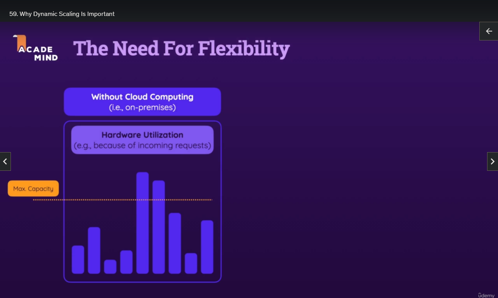
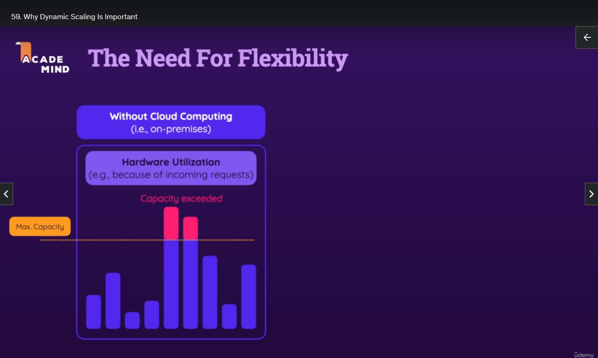
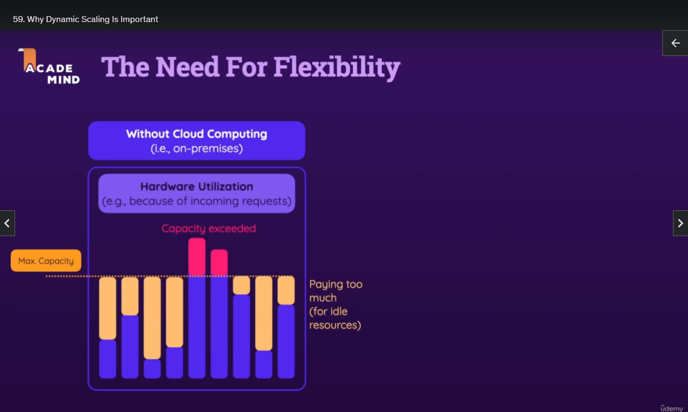
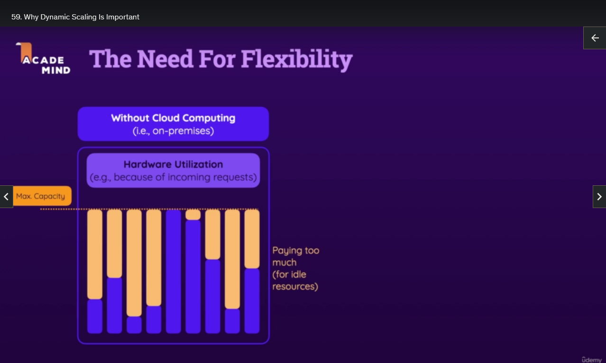
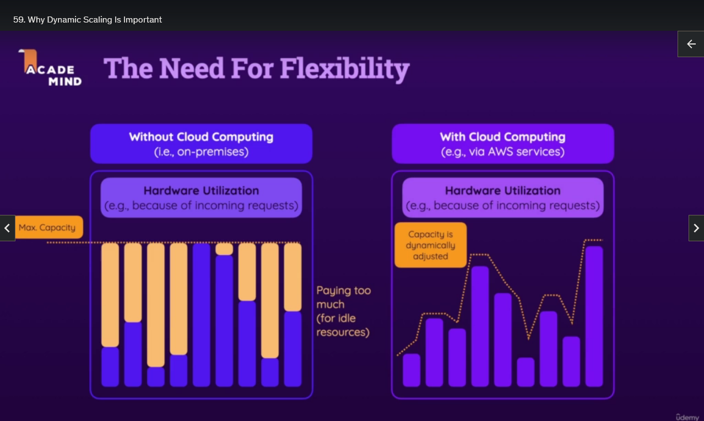

## Why Dynamic Scaling Is Important

Now, when running workloads in the cloud with AWS, you often have a great need for flexibility. Imagine that you're running a web server in the cloud. Then, of course, you want to make sure that it's able to handle all incoming requests, no matter if you have just a few users or if you're doing some sale and you're getting thousands or millions of visitors all of a sudden. So your traffic pattern of a website could look something like this.

And without cloud computing, if you're running your own servers in your own data centers, you will have some max capacity, a maximum amount of capacity dictated by the hardware and the number of machines you have in your data center. As you can see here, that means that if you had a traffic pattern like this, if you had certain spikes in your traffic pattern, then, of course, your capacity would be exceeded. And that means, in the case of a web server, that you would not be able to serve all your visitors. Your machines might even go down because they get overwhelmed, and you might, therefore, not be able to serve any visitors for a short period of time, which, of course, would not be great.

On the other hand, that max capacity is not just the maximum capacity you have, but typically also a fixed capacity because you have a certain number of machines in your data center, and you can't add more to them just like that, but you also can't get rid of them if you don't need them, which means you're also paying for idle resources. You're paying too much for all the parts where the traffic is below, or where the amount of work that has to be done is below this fixed max capacity. So you have disadvantages on both sides. You're paying too much if you don't have enough traffic, and you might lose visitors, you might lose business if you get too much traffic without cloud computing with your own data center.

Now, of course, one solution when having your own data center would be to add more capacity. Then you wouldn't exceed it, which is great. But, of course, that means you have to continue to upgrade to make sure that you have always enough capacity, and you, of course, are paying even more for all those idle resources.

The great thing is that when you're using cloud computing like AWS, that all changes. Now you, in the end, can adjust the capacity you have dynamically based on the traffic pattern you're seeing. You can add more EC2 instances, for example, when you need them. So, if traffic increases, if you have more visitors, if you know that you got an upcoming sales campaign, you can add more instances to handle all that traffic, and you can decrease the number of instances if you don't need them anymore so that you're not paying too much. And that's one of the advantages of AWS or cloud computing in general. You have that scalability, you have that elasticity, which means you can add or remove instances pretty much instantly, and you have a high availability of your website, for example, because you can make sure that your services, your website, doesn't go down because you don't get overwhelmed because you can add more instances, more compute power.

