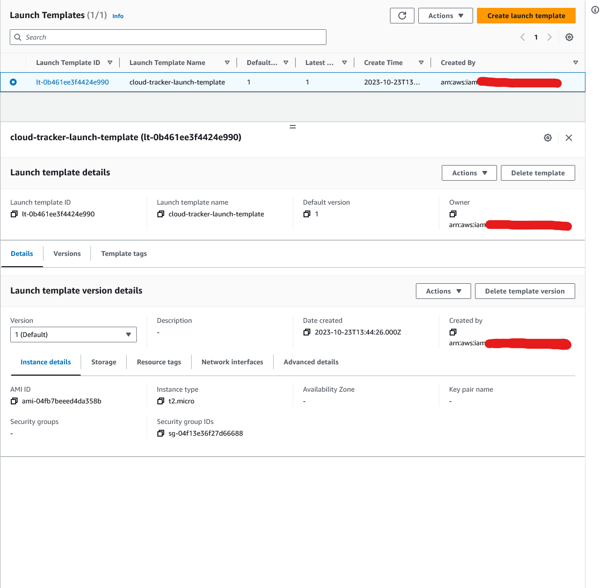
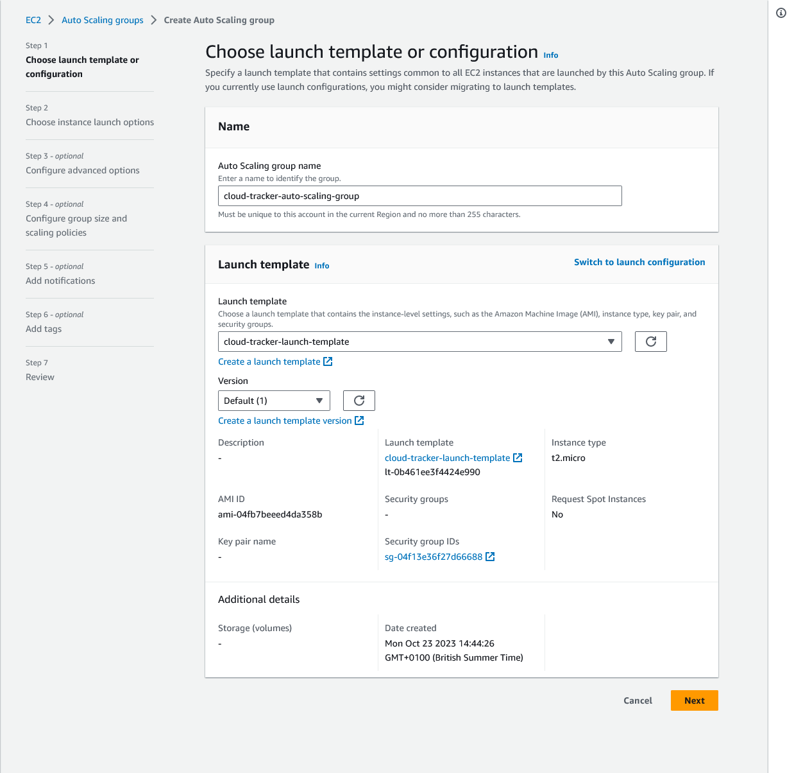
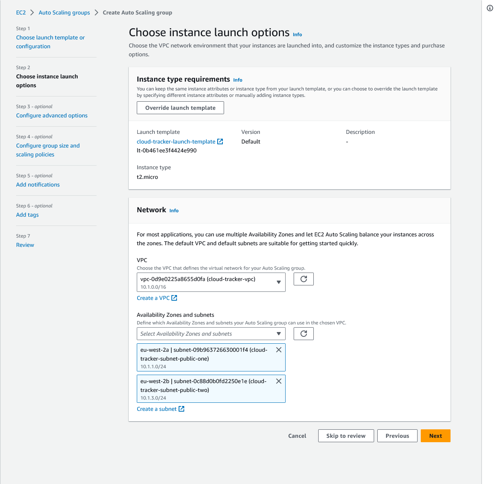

## Working with Autoscaling Groups

Now, let's take a brief look at EC2 auto scaling. You can reach it from the EC2 console here from the management console, the EC2 page. And at the moment, I got no instances up and running there. Now, if you would want to have some instances which are managed with help of auto scaling, you can easily set this up from this page because here on the left, if you scroll down, you got the auto-scaling area where you can configure auto-scaling, and it's the auto-scaling groups that are interesting to us here. When you create an auto-scaling group, you, in the end, create a group of rules that will ensure that a certain amount of EC2 instances are running based on certain conditions you set.

So here you can give this group any name of your choice, and then you have to choose a launch template. And the launch template is simply a feature that tells AWS how your EC2 instances should be configured. Because, of course, when we launch EC2 instances manually, as we did before, if I do this in a separate tab, if we use this wizard, then we choose all these base settings like the AMI we want to use or the instance type. Now, if we use EC2 auto scaling for launching instances, that will not be done manually by us, and therefore we have to tell AWS which configuration should be chosen for the instances that will be launched. And that's done with a launch template which you can create. And then in here you simply choose basically the same settings as you do in this easy to launch wizard.

So here you can also choose an AMI, for example, the Amazon and Linux AMI, and then which exact version you want to use. You also choose an instance type though you can also choose that this should be overridden that you have to set it when you then do configure the auto-scaling group. But here I will choose T2 micro. You can also choose a key here and all the other settings though, you can basically always also choose not to set it in the launch template, and then you would have to take care of it when you configure the auto scaling group of course. Now some settings are best set here in the launch template, though, for example, we could say that we want to use our default security group or create a new security group here, and make sure that we choose a certain VPC here where the instance should be launched. Also go up here and maybe even choose a subnet if we want to, though, we don't have to. We can also let the auto scaling service take care of that for us so that it chooses subnet automatically. And we can add our security groups here; our security group rules I mean, for example, allow SSH traffic from anywhere and so on. So all these things can be set here. It, of course, looks very similar to the experience you know from the launch wizard because it is about doing the same thing about launching EC2 instances. But once you create such a launch template, you're not launching an actual instance. Instead, you just create a template which can be used in the future to launch instances based on that template.

For example, by the EC2 auto-scaling service. So here, I just give this security group a name and a description and then, I can create this launch template. And with that launch template created, if we refresh here we can choose this template here, and then also check those settings here; see if they are right for us and continue. Now, when you then continue creating such an auto-scaling group, you also have to choose for which VPC it is, which subnets should be chosen for launching the instances. Because if you let auto scaling decide where instances should be launched, you have to tell AWS which subnets can be used for launching instances. You then can override your launch template here, as I mentioned, if you need to. And continue with a couple of other settings. For example also by adding a load balancer here, because as I mentioned, it's not too helpful to have many instances up and running if it's then still the same instance that has to handle all the traffic. Instead, you typically want to use a load balancer for that.

