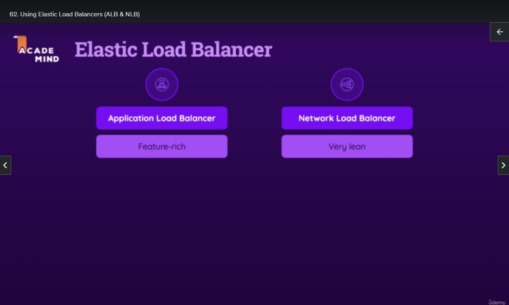
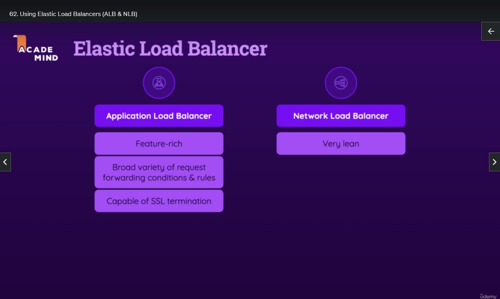
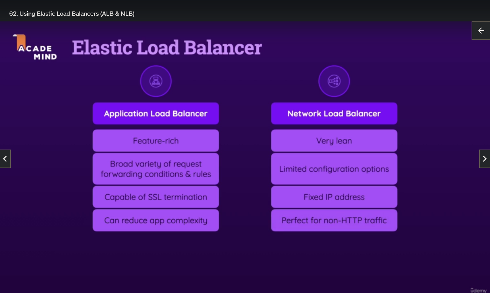
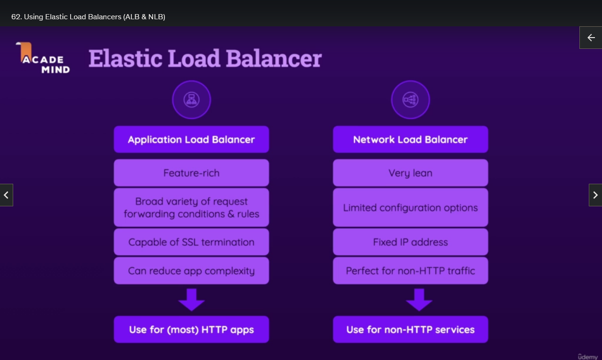

## Using Elastic Load Balancers (ALB & NLB)

Now, when it comes to Load Balancers, AWS offers two main Load Balancers that can help with distributing traffic across EC2 Instances, and that would be the Application Load Balancer and the Network Load Balancer.

Now, the exact details aren't too important here for this basic exam and course. Generally, the Application Load Balancer is more feature-rich, so it has a lot of configuration settings, whereas the Network Load Balancer is leaner and offers fewer features. It can, therefore, sometimes offer better performance, though the Application Load Balancer should typically be your default choice for distributing traffic for tasks like Web Service, for example.

With the Application Load Balancer, you can set a broad variety of request forwarding conditions and rules. You can inspect HTTP requests, for example, and decide which instance should handle which kind of incoming request based on cookies or paths of the request, and so on. So you've got detailed load balancing rules you can set here. It's also capable of SSL termination. Just in case it's not clear what SSL termination means, it means that the Load Balancer can act as an endpoint for incoming HTTPS requests. So encrypted secured HTTPS requests sent by your users, and it's the Load Balancer that will then basically decrypt those requests and forward the unencrypted requests to your application running on an EC2 Instance. But that forwarding, then of course, happens inside of the AWS network and, therefore, it isn't a problem that it's not encrypted anymore. The advantage of this would be that your application, that you might be running on top of an EC2 Instance, your web server, for example, doesn't have to care about SSL certificates and request decryption because the Load Balancer takes care of that. So that's a neat feature, and the Application Load Balancer offers it.

With the Network Load Balancer, you have more limited configuration options, though SSL termination would be possible there as well. Another key difference is that with the Network Load Balancer, you actually get a fixed IP address by AWS, which can be useful for some tasks. With the Application Load Balancer, you don't get that. However, if you do, for example, register a custom domain, something we'll also explore later in the course, you could connect that domain directly to an Application Load Balancer, so that missing fixed IP typically isn't a problem. But if you need a fixed IP, only the Network Load Balancer gives you one. Again, these details really aren't too important here. I'm just giving you some differences so that you have at least a basic idea of why we have different Load Balancers.

Now, the Application Load Balancer, since it is able to do so many things, can reduce your app's complexity. The Network Load Balancer is especially great for non-HTTP traffic. So if you're running workloads on top of EC2 where you want to balance the workload, and we're not talking about HTTP requests, so you're not running a web server, but you're running other kinds of workloads that get other kinds of incoming requests, then the Network Load Balancer shines. For web servers and HTTP requests, you typically use the Application Load Balancer. These are these two kinds of Load Balancers, just to give you a basic introduction.

