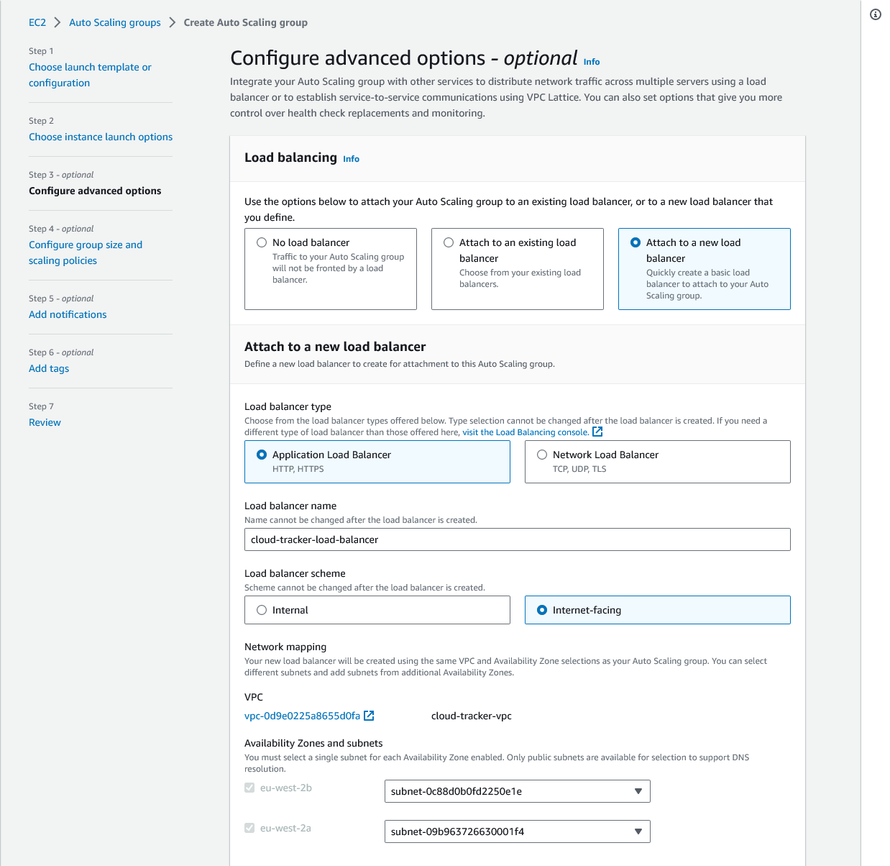
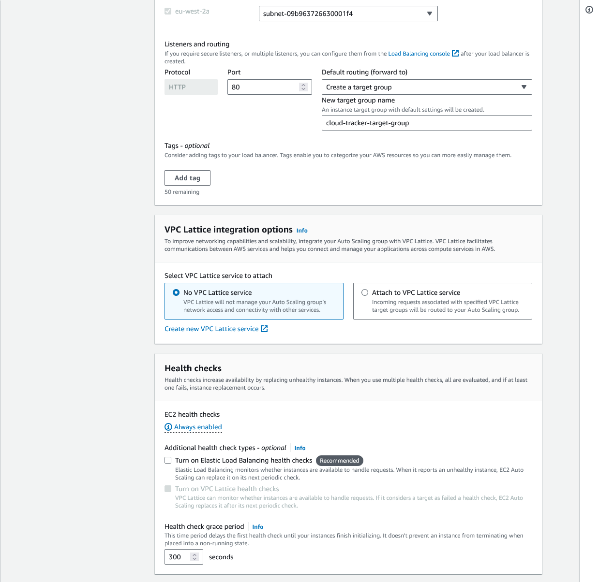
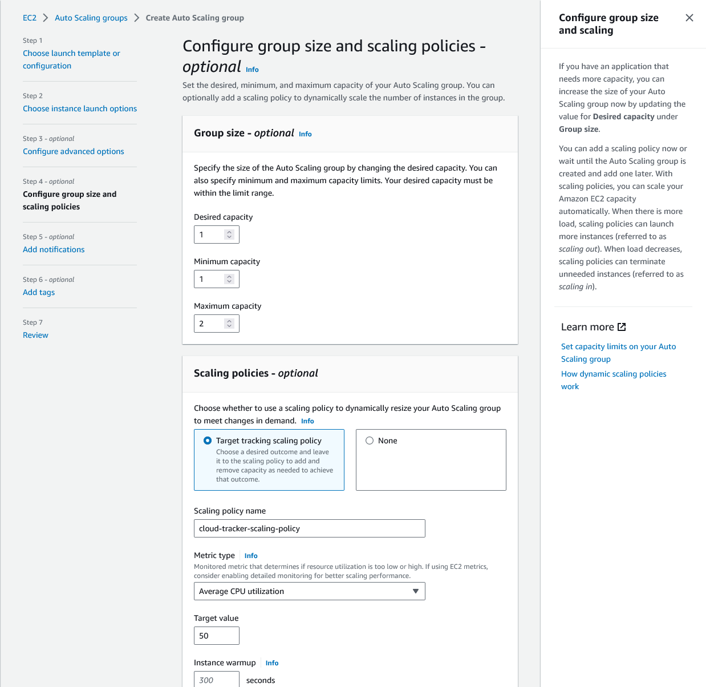
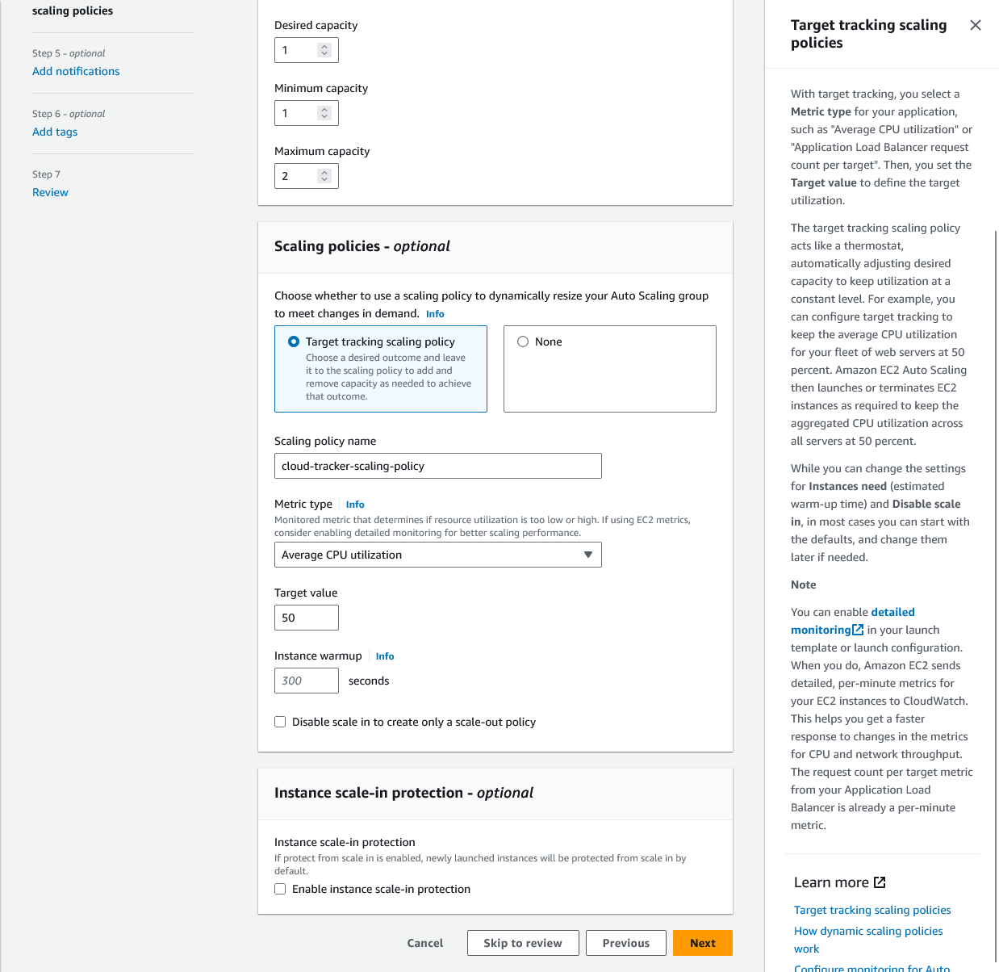
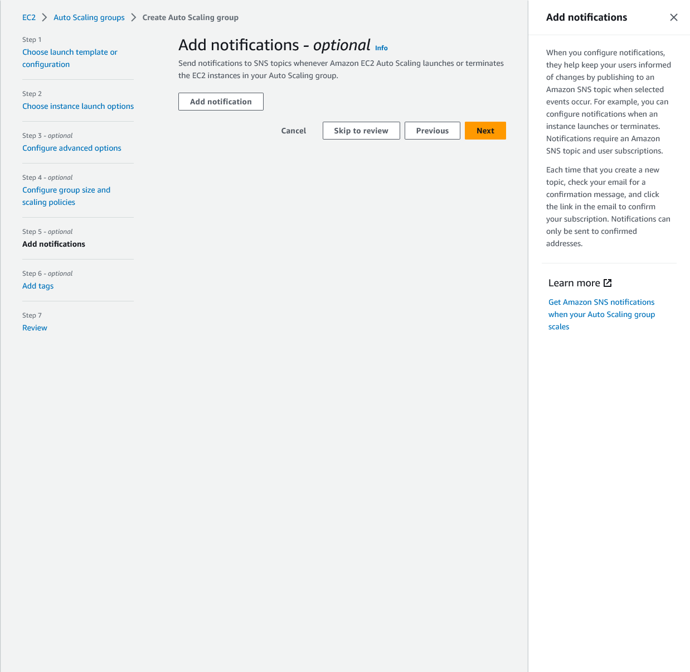
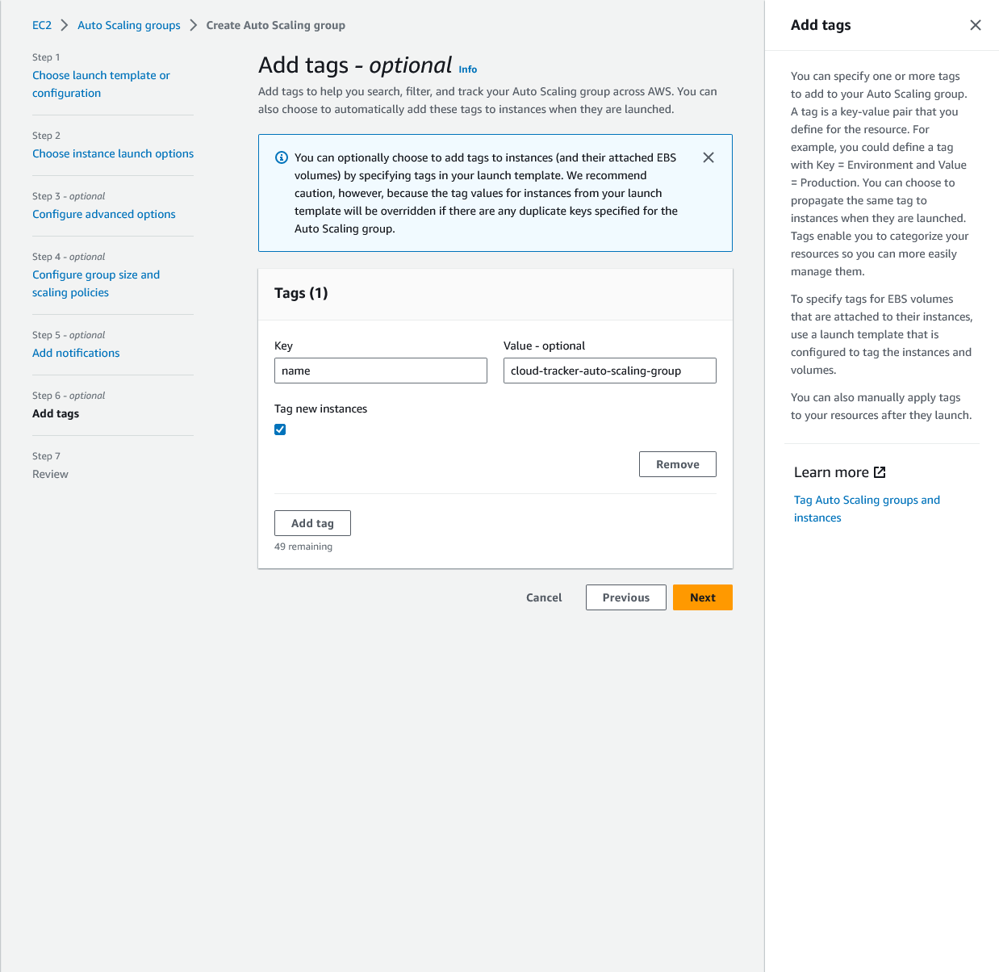
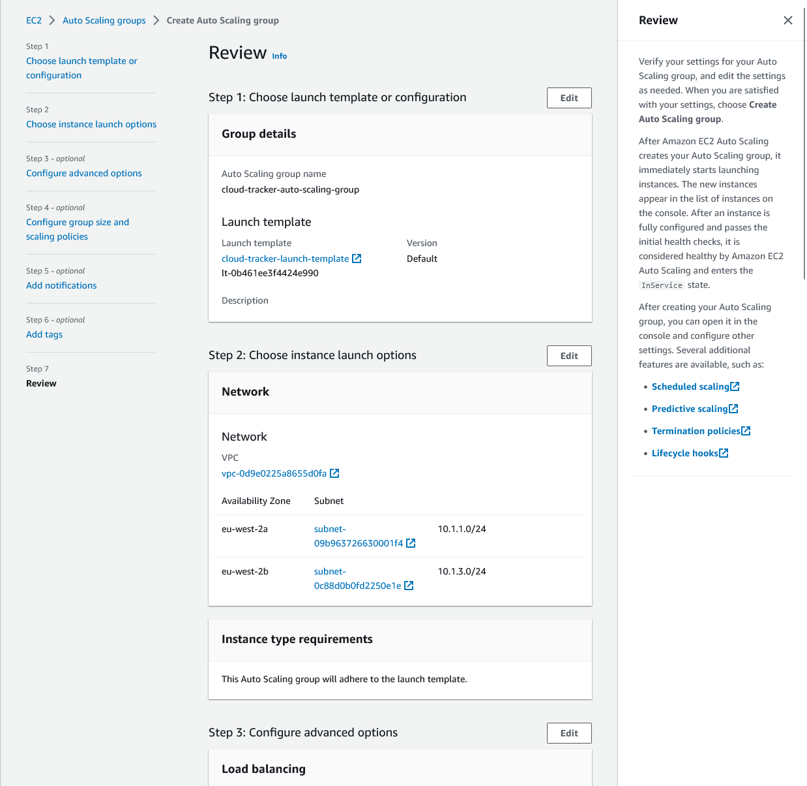
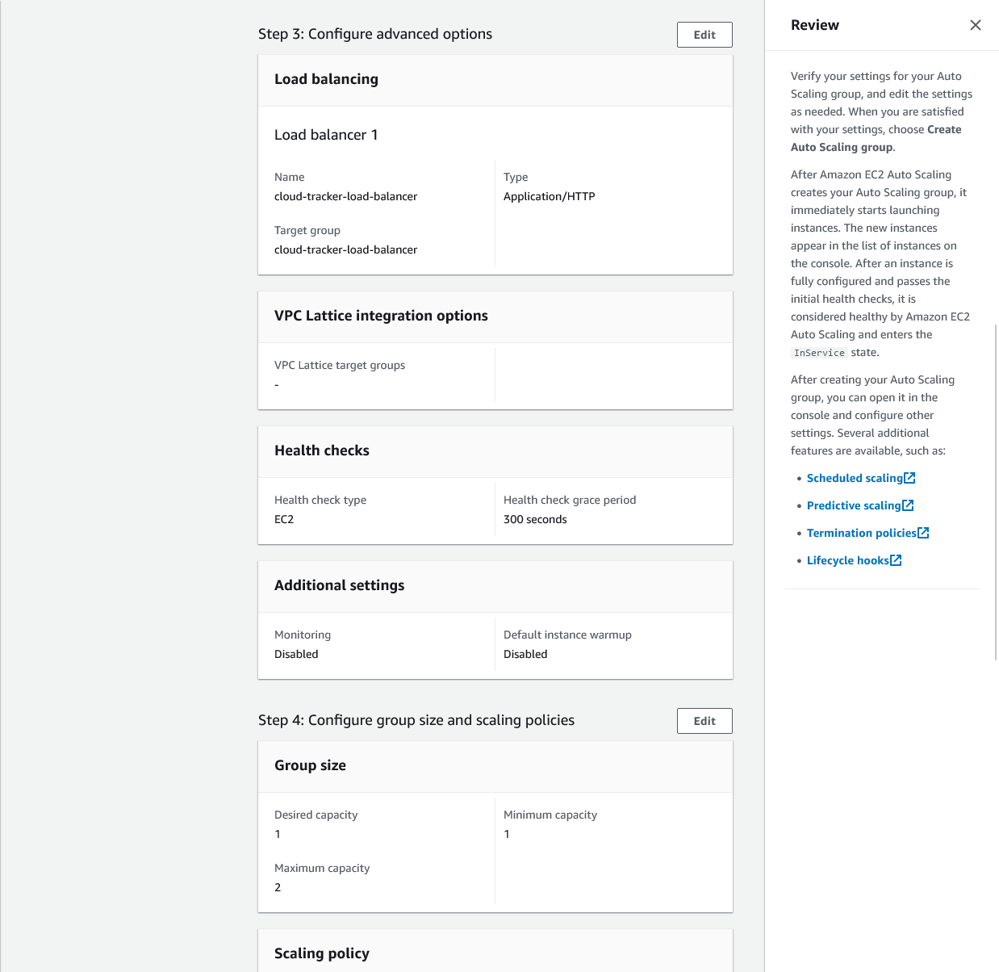
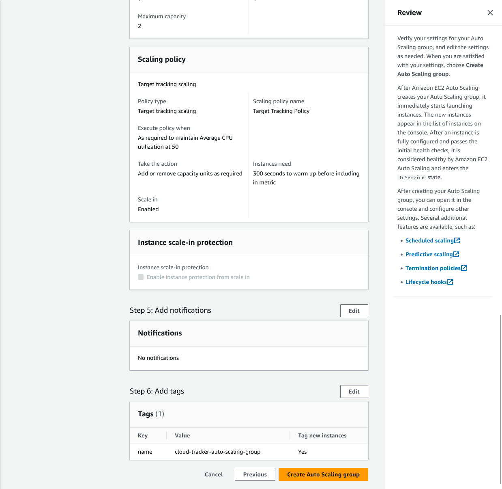

## Creating Load Balancers & Combining Them With Scaling

Now, you can create load balancers directly from inside this EC2 Auto Scaling wizard here if you don't have one already. Of course, you could also attach an existing load balancer if you did create one before. Load balancers can also be created from inside the EC2 dashboard here if you go to Load Balancers.

But you can also add a new load balancer and then choose if it's an application or network load balancer, and as mentioned, for web servers, you typically choose an application load balancer. You give that load balancer a name and you choose whether it's internal or internet-facing.

And here, if we would run a web server, we would choose internet-facing because, of course, it should be to handle incoming HTTP requests and then forward them to our instances basically. And we also have to choose a VPC and the subnets, and of course, those should be the same as for the Auto Scaling group because we want to make sure that the load balancer is capable of forwarding requests to instances that are running in those subnets in the VPC we chose for the Auto Scaling group as well. So we want to have those same settings here.

Then you also have to set up the rule for which kind of requests you want to listen. For example, here that we're listening for HTTP requests. And then we can create a new target group as it's called, which is basically a group of instances that will be used for forwarding requests to.

And if a load balancer is connected to an Auto Scaling group, as it is here, then it will automatically add all instances that are created by that Auto Scaling group to that target group, which we're creating here. You could also add instances manually to such a target group, and then the load balancer would start forwarding incoming requests to that target group for you, but if you create those two services in conjunction, then the load balancer will also automatically add EC2 instances launched by the Auto Scaling service to that target group. So it will automatically include those automatically launched instances.

Well, and then we just got some other settings, like health checks, which basically defines how AWS determines whether an instance that was launched by the Auto Scaling service or that is covered by the load balancer is healthy. So whether it's capable of receiving requests or if it should maybe be replaced because, of course, you want to replace instances that crashed somehow. You don't want to forward requests with the load balancer to instances that crashed, and the health check here basically allows you to ensure that AWS does check whether those instances are up and running.

And then if you continue, you also have to choose some Auto Scaling conditions or rules here. Now, when it comes to defining rules for Auto Scaling, you set the capacities you want to have for your instances. So this is now not related to the load balancer but to the Auto Scaling service.

The desired capacity is basically the default capacity you want to have. For example, you could aim for a base level of having one instance up and running. You can then also set a minimum capacity below which you never want to go and a maximum capacity, which is the highest number of instances you want to have up and running in case of increasing traffic requirements. So we could have a setup like this, for example.

Then you can also add scaling policies, and you typically want to do that where you, in the end, define based on which metric you want to scale up. For example, you can tell AWS and the Auto Scaling service that it should monitor the average CPU utilization of the EC2 instances that are part of that Auto Scaling group. Or some other metrics. And that maybe if we exceed 50% of CPU utilization, so if our CPU utilization goes above 50%, we want to start adding more instances. It maybe tells us that traffic is increasing and we want to scale up. And of course, we want to do that early enough. And if we go below that average utilization for all the instances that are part of the Auto Scaling group, then we would scale down and start removing instances, for example. So that's how we would define those rules.

Now, in the next step, you can then also add some notifications so that you maybe get an email if new instances are added so that you know what's happening in your cloud environment. You can add tags as always to identify resources, and then finally, you can review all settings and create that Auto Scaling group if you want to. Now, I'm not going to do this here but that's how you would use Auto Scaling and most importantly, now you also know what the core idea behind Auto Scaling is.

