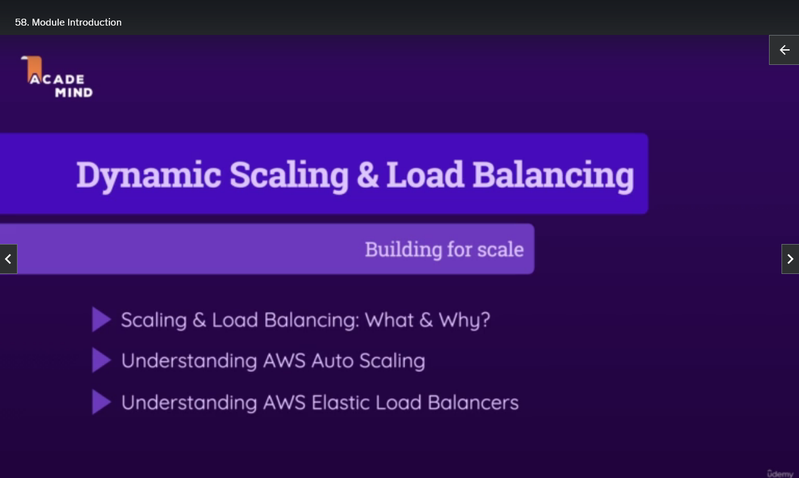

## Module Introduction

We have now explored the important EC2 service and, related to it, also the idea behind VPCs and custom networks in the cloud. Now, of course, VPCs are especially relevant if you have more than one running EC2 instance because, as you learned in the previous course section, VPCs also group and structure instances.

In this course section, we're going to build upon that idea of having multiple EC2 instances. This course section will introduce the ideas behind dynamic scaling of instances and what exactly that is, and of load balancing. We're going to learn what exactly these terms or concepts are all about before we then also explore some key AWS features and services that help us with automatically scaling our EC2 instance number and the AWS Elastic Load Balancers and what these services are all about.

So, let's dive right in.

