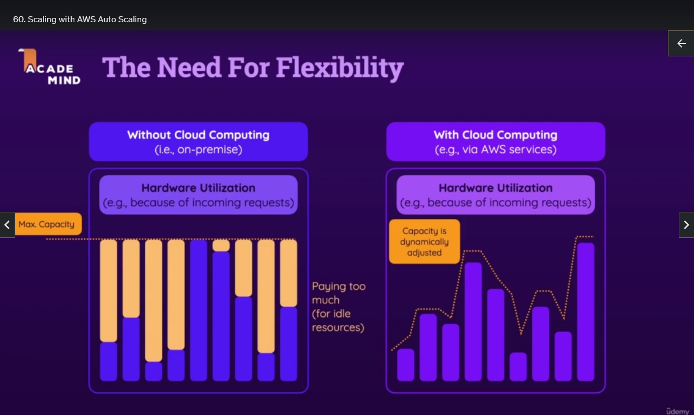
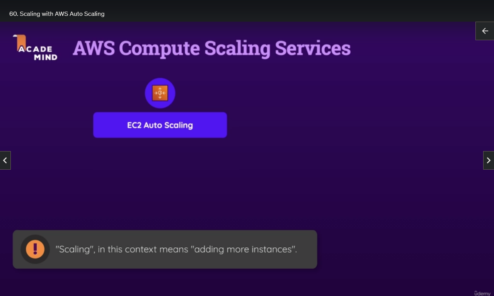
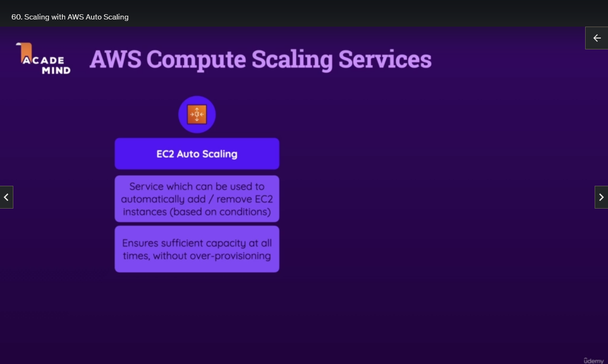
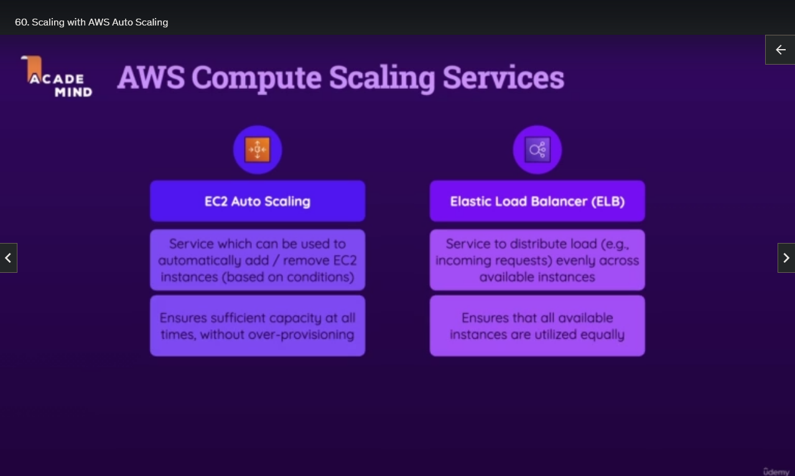
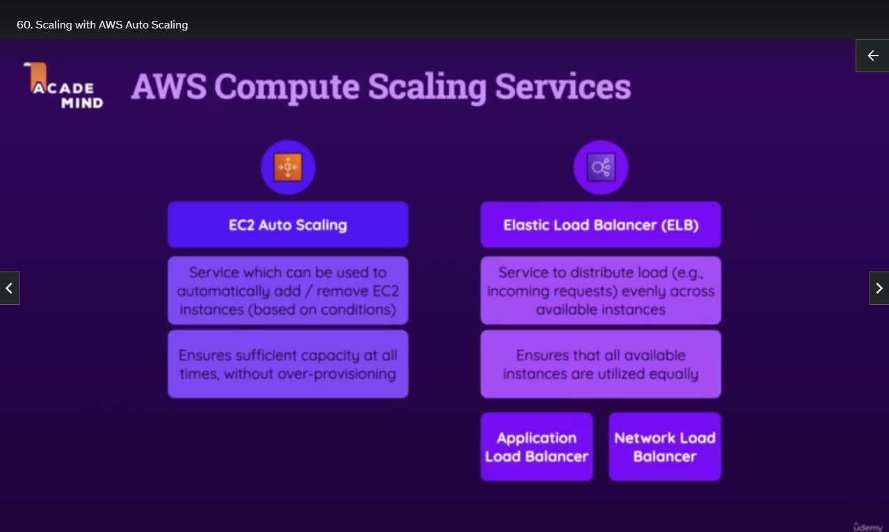

## Scaling with AWS Auto Scaling

It's great that with cloud computing, you can dynamically adjust your compute power to your requirements. But of course, it's still not ideal if you have to do that manually. It's better than nothing and can be very useful if you know that a certain event is coming up, a sales campaign for example. However, it would be even better if you could scale your compute power dynamically. If you could automatically detect that traffic is increasing and you automatically add more instances, which you then also remove as soon as they're not needed anymore.

AWS indeed gives you some services that help you with scaling and distributing incoming traffic amongst your instances, and regarding the scaling part, EC2 Auto Scaling is the key service that helps you with, as the name suggests scaling your EC2 instances automatically.

It is a service that can take care of adding or removing EC2 instances based on certain conditions you set. So it ensures sufficient capacity at all times, without over-provisioning. It also gets rid of instances that are not needed anymore. So that's one key service you should know, and one key service we'll also take a brief look at in a couple of seconds.

Another key service that's important is the Elastic Load Balancer service, which actually consists of multiple sub-services, as you will see. In the end, all these Load Balancer Services that AWS offers are about distributing load, for example, incoming requests evenly across available instances. It's great that you can start multiple instances and run your web server on multiple instances, and it's great that you can do that automatically with EC2 Auto Scaling. However, it wouldn't be very useful if the incoming traffic then wouldn't be distributed amongst all the running instances. The load balancer services take care that all available instances are utilized equally. They decide which incoming request should be forwarded to which instance so that you don't have to do that manually somehow, ensuring that no single instance gets overwhelmed.

Because of course, it would be pretty bad if you do automatically add more instances and then it's still one of the same instance that has to do all the work. With the Load Balancer Services, that will not be the case. I'm saying services because here we got two main services, the Application Load Balancer and the Network Load Balancer, and I'll get back to those in a couple of minutes, as well.

