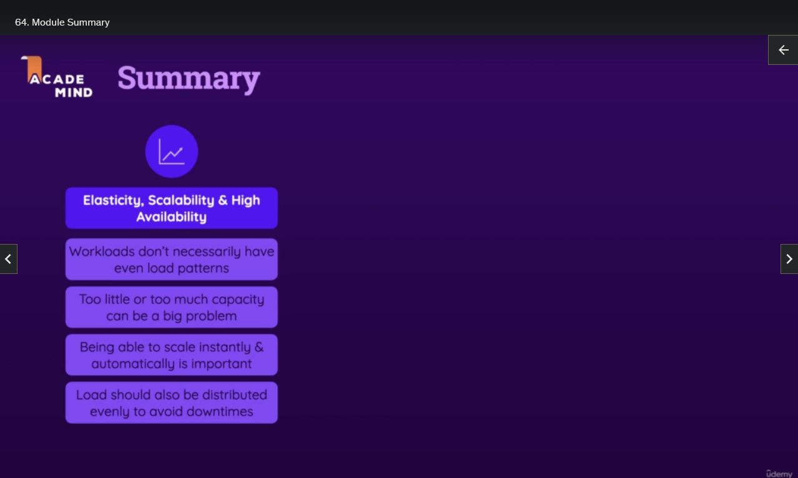
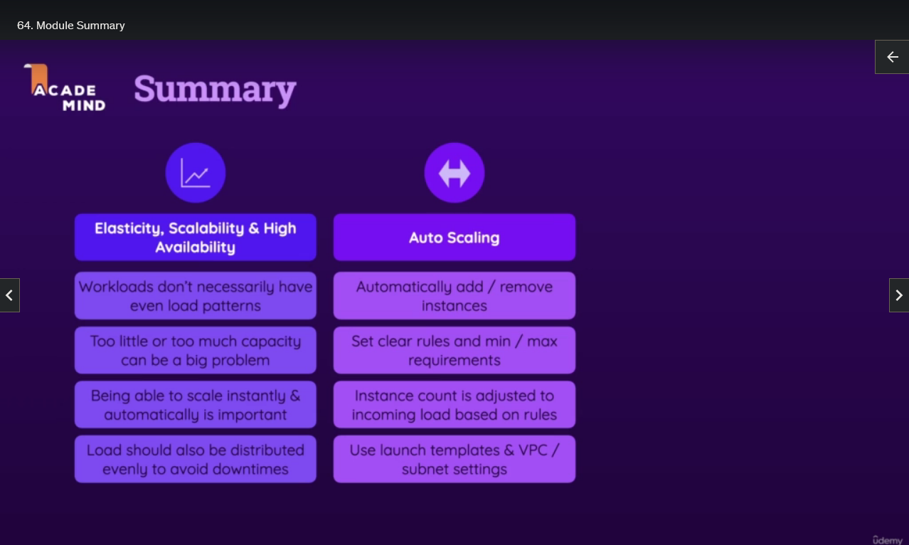
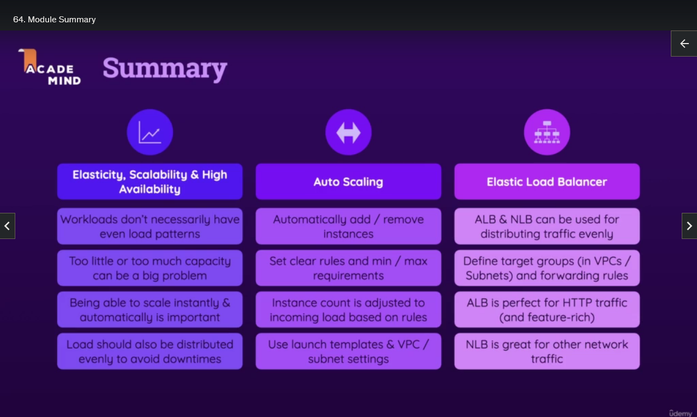

## Module Summary

Now, that's it for this course section already. Because with this course, the core idea is that you get a great overview of the core features and services AWS has to offer, as well as auto scaling and load balancing. Understanding how AWS helps us with keeping up with different workload requirements and spikes in your workload is crucial, because AWS is about elasticity, scalability, and high availability. These are advantages you gain when using AWS.

Workloads don't necessarily have even load patterns. You might have a spiky pattern regarding incoming website requests, for example. And too little or too much capacity can be a big problem. If you have too little, your service might crash, and you lose out on business. If you have too much capacity, you're paying for too much, even if you don't need it. That's why it's important to be able to scale instantly and automatically. Elasticity is about being able to scale instantly whenever you need to, and the term scalability, of course, means that you can scale in general.

And, of course, if you do scale up, if you do add more instances, you also want to make sure that the workload is distributed evenly across all those instances. That's where load balancers can help you, and where you really lock in that high availability advantage, because with auto scaling and load balancer, you make sure that you have enough capacity and that you're using it correctly and that ensures that your website is highly available, doesn't go down suddenly, and you, therefore, don't lose out on business.

So auto scaling is one of the key services I already mentioned, and it's about automatically adding or removing instances as you learned, based on rules you set with a min and max requirement of instances you want to have. And the instance count is then adjusted based on the incoming load. It scales automatically and uses the launch configuration, the launch template you set with the VPC and subnet settings you set in there. So you have full control over the instance type, AMI, and the place where it's going to be launched, but you don't have to launch it manually.

Now, as mentioned, very often, being able to scale automatically is great, but not everything. You also want to distribute the load evenly. That's where the elastic load balancer service comes into play. You got two main load balancers, ALB and NLB, which stand for Application Load Balancer and Network Load Balancer. Those can be used for distributing traffic evenly. You can generally use both, but you typically use the application load balancer for websites and web servers because it gives you more features related to deciding which requests should be forwarded based on which rules. By the way, those rules would be set after the load balancer was created, and then you can edit it and add all the rules you want to add.

When you use a load balancer, no matter which one it is, you define target groups connected to VPCs and subnets, which are basically the groups of instances that should be considered for forwarding incoming requests. When connected to an auto scaling group, the instances launched by the auto scaling service will be added automatically to the target group. As mentioned, ALB is perfect for HTTP traffic because of all its features. NLB is great for other network traffic and can sometimes offer better performance, though for many use cases, that will not matter or might not even be measurable.

These are the key features you should know about auto scaling and load balancing. With that, it should now be clear how you can run workloads in the cloud and how you can make sure that they stay up and running, even if your traffic or workload pattern changes.
