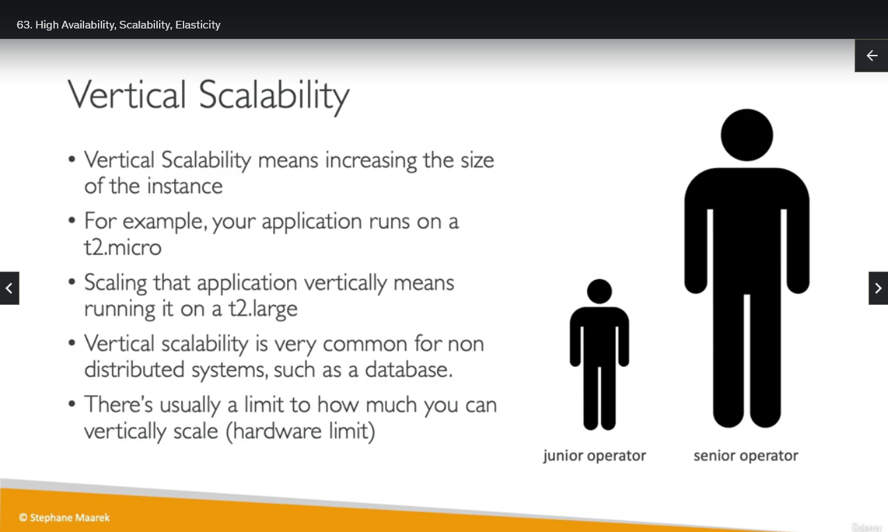
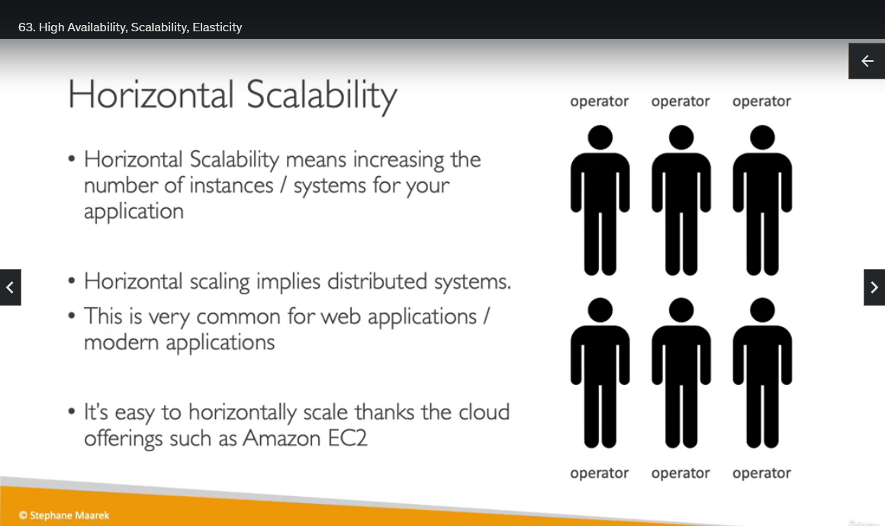
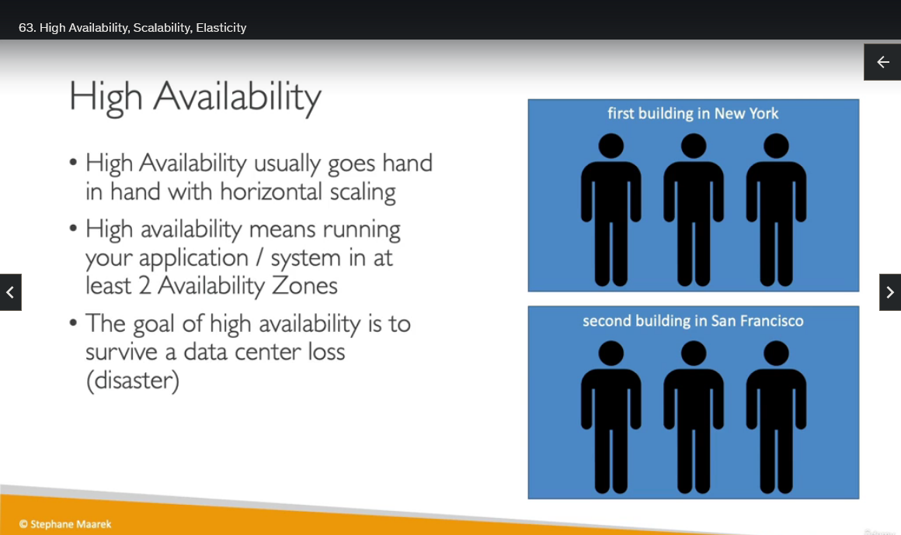
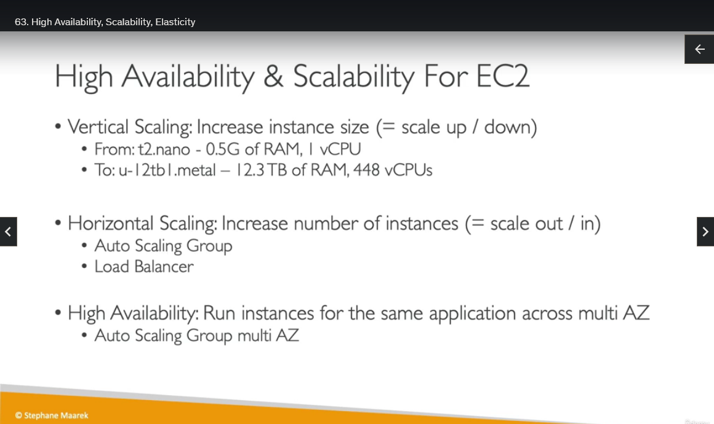

## High Availability, Scalability, Elasticity

Welcome to this session on Elastic Load Balancing and Auto Scaling Groups. This is a section where we really see the power of the AWS cloud and the cloud in general, and see how these new paradigms we saw really help us shine and make our application scales seamlessly.

So let's discuss the concept of Scalability and High Availability. So if your applications can scale, that means that it can handle greater loads by adapting. And there are two kinds of scalability in the cloud. There is vertical scalability and horizontal scalability, also called elasticity. So the scalability is going to be linked, but different to high availability. And these things are going to be discussed in this lecture.

So let's do a deep dive. And we'll be using a call center as an example. So imagine, we have a call center and we just receive calls. Now let's see what it means to be scalable in that case.

So first, let's deal with vertical scalability. In AWS, when you are vertically scalable, that means that you can increase the size of the instance. So for our call center, say we have a junior operator and say we were able to upgrade that operator, we would get a senior operator. And for example, the senior operator can handle a lot more calls than the junior operator because it's more experienced. So this would be what vertical scalability looks like in a call center. If we could upgrade obviously, a junior operator into a senior operator.

In AWS, for example, say your application runs on the t2.micro, and to do a vertical scalability for that application, that means that now we run our application on a t2.large. So we've changed the size of our EC2 instance. And vertical scalability is very common when you have a non-distributed system, for example, a database. If you want to give more performance to your database, you would just increase the size of your database. But usually with vertical scalability, there is a limit to how much you can vertically scale and that is a limit of the hardware. Even though nowadays these limits can be very, very, very high.

Okay, next is horizontal scalability. So that means that now instead of increasing the size of your EC2 instance, you increase the number of instances or systems for your application. So back into our call center example, we have an operator, and we want to do horizontal scalability for that operator, that means we will add another operator. And if we need to handle more calls, we will add another operator, and so on. So maybe we can scale horizontally from one operator all the way to six operators. So when you have horizontal scaling, that implies as you can see on the right hand side, that you need to have a distributed system. And for call center, that makes sense. You don't need these people to be talking constantly. For a call center, each of the individual operators can take calls on their own. In AWS, or for web applications, so this is going to be very common, so if you have a web application or a modern application, you usually design it with horizontal scalability in mind. And it's super easy on AWS to scale, thanks to Amazon EC2 and auto scaling groups, and we'll see this in the section.

So now let's talk about High Availability. And it goes hand in hand with horizontal scaling. High availability means that you are running your application and system in at least two availability zones on AWS. But for our call center, what does it mean? That means that we have a call center in New York, and maybe a second call center in San Francisco. And somehow, if one of these call centers is down, for example, say there's a power outage in New York, then we can still take calls in San Francisco. And so we are highly available. Obviously, San Francisco will be more busy, but we are at least surviving the disaster of a power outage in one of our buildings. In AWS you use two availability zones, obviously. And the goal of it is to usually survive a data center loss, a disaster. And in AWS, it could be an earthquake, that could be a power outage that could a lot of things.

Okay, so to summarize, High Availability and Scalability for EC2. If we have vertical scaling, that means that we're increasing the instance size. So we can scale up if we're increasing it or scale down if you're decreasing it. So we can go all the way from a T2.nano of 0.5 gigabytes of RAM, and one vCPU, all the way to, and obviously they can change over time, a u-12tb1.metal, which is a very scary name, but has 12.3 terabytes of RAM, and 448 vCPUs. That is for vertical scalability. Now for horizontal, this is when you increase the number of instances, it's called scaling out, or when you decrease the number of instances, it's called scaling in. And for this, we'll be using an auto scaling group and a load balancer. This is the topic of this section, and then when we have high availability, that means that we run the instances of the same application across multiple availability zones, and this will be again leveraged by an auto scaling group in multi AZ mode. And a load balancer in multi AZ.

One last word. So the exam will as could you figure out is this scalability, is it elasticity, is it agility? And so I just wanna give you some formal definitions, so to summarize. Scalability is the ability for a system to accommodate a larger load by making the hardware stronger or scaling up, or by adding nodes scaling out. This is when your application can scale. Now, elasticity is something a bit more cloud native. This is once a system is actually scalable, so you can either scale up or scale it out. Elasticity means that there will be some sort of auto scaling in it, so that the system can scale based on the load that it's receiving. And in this case, we're going to pay per use, we're going to match the demand we're receiving with a number of servers, and obviously, we're going to pay just the right amount so we will optimize cost. So in AWS, elasticity is a key concept. And agility is absolutely not related to scalability or elasticities, it is a distractor. But just to remind you what it means, agility means that the new IT resources are only a click away, which means that you can reduce the time to make these resources available to your developers from weeks to just minutes. And so your organization is more agile, it can iterate more quickly and you are going faster, okay? So that's it for this section on introduction. I hope you liked it and I will see you in the next lecture.
