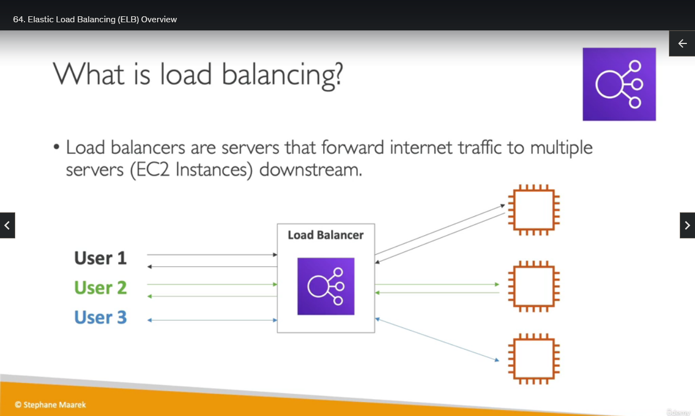
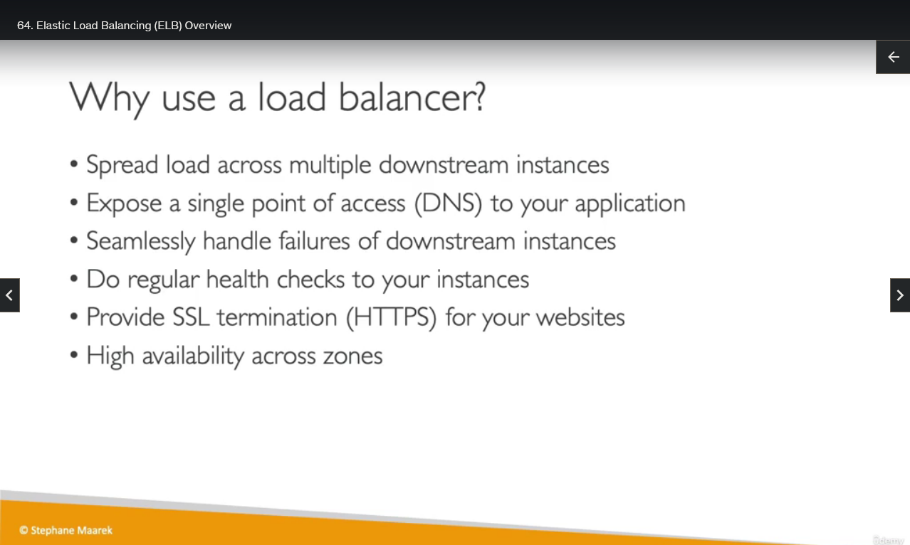
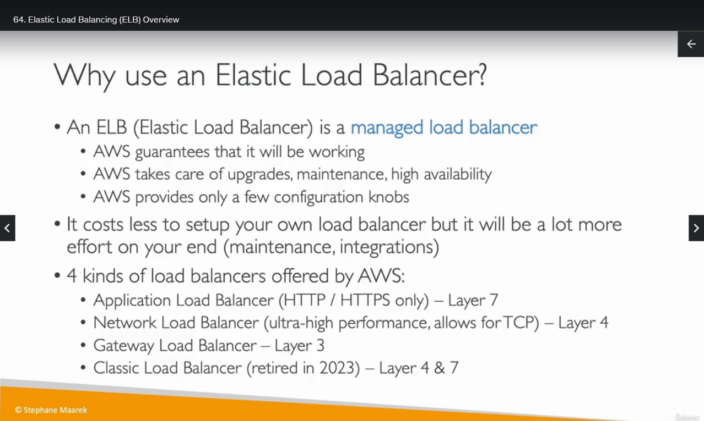
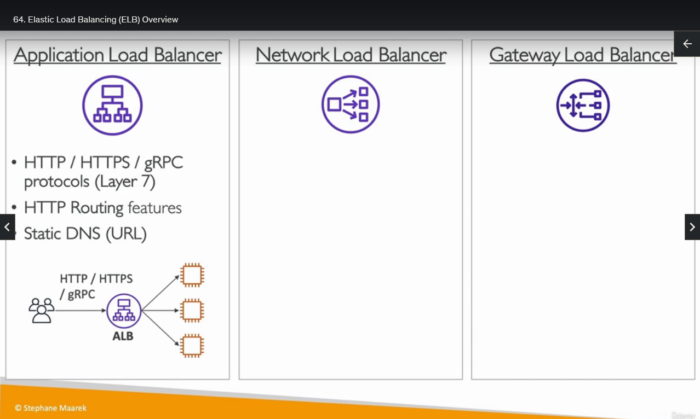
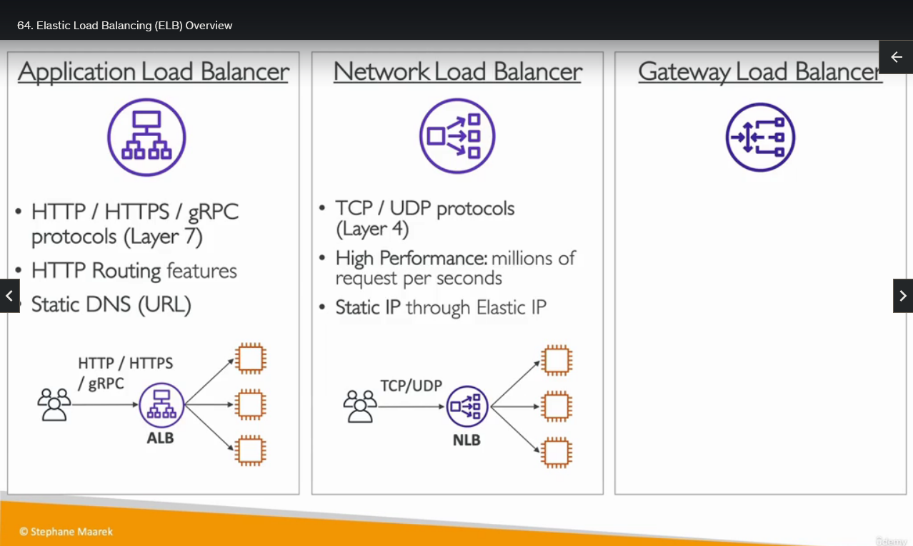
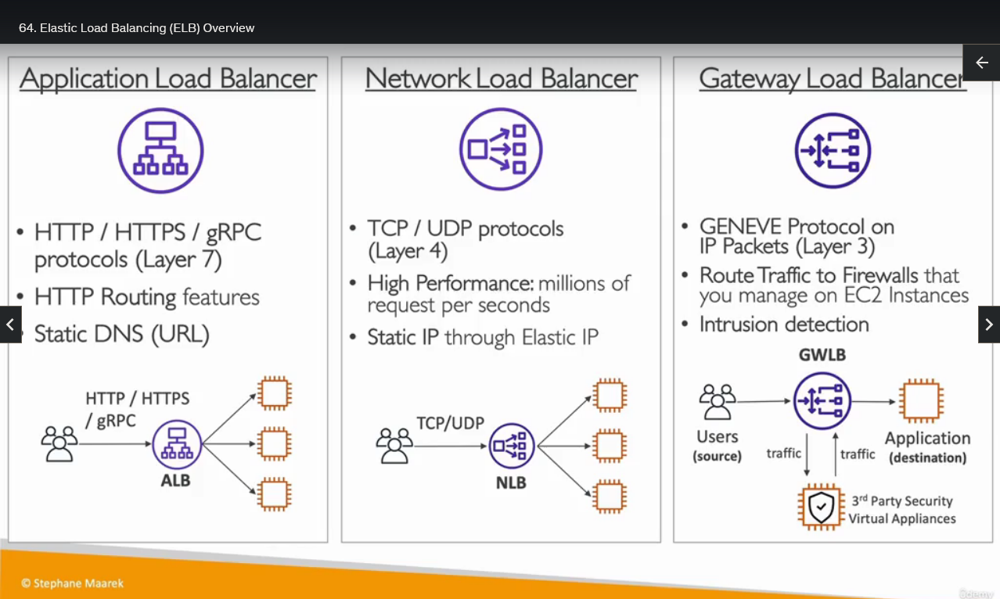

## Elastic Load Balancing Overview

So let's see, the first service that will allow us to be more Elastic on AWS, this is called Elastic Load
Balancing.

So a Load Balancer is a server that will forward the internet traffic down to multiple servers downstream, and for then there will be EC2 instances. They're also called the backend EC2 instances. So Elastic load balancing is something that is managed by AWS. So we have a Load Balancer and this is what we will be publicly exposing for our users.And behind that Load Balancer, we will have multiple EC2 instances, maybe three in that case. And then we have our first user talking to our Load Balancer, okay? And the Load Balancer will be directing the traffic to one of these EC2 instances. And the EC2 instance will reply back with something and the user will get the response. But now if a second user comes in, then they will get the reply from another EC2 instance. And if a third user comes in as you can expect, it will be replying from another EC2 instance. And so the Load Balancer, the more users we have, the more it will balance the load across multiple EC2 instances and that will allow us to scale better our backend.

So why would you use one? I think it's clear. You can spread the load across multiple downstream instances. You can expose a single point of access, DNS hostname, for your application. You can seamlessly handle the failures of downstream instances. So we do regular health checks on them, and if one of them is failing, then the Load Balancer will not direct traffic to that instance. So we can hide the failure of an instance using a Load Balancer. We can also provide SSL termination, so HTTPS for your websites very easily. And you are able to use a Load Balancer across multiple availability zones, which was making your application highly available.

Okay, let's keep on going. So the ELB is a managed Load Balancer, so you don't need to be provisioning servers. AWS will do it for you and AWS will guarantee that it will be working. AWS will take care of all the upgrades, maintenance, and high availability of that Elastic Load Balancer. And the only thing we have to do is to configure a few things for the behavior of that Load Balancer. It's obviously less expensive if you want to set up your own Load Balancer on EC2. It is definitely possible, but in the end, there will be a lot more effort on your end for maintenance, integration, maintaining and taking care of the operating system, upgrades, etc. etc. So there are four kinds of Load Balancers offered by AWS and I need you to know the differences between them. So the first one is the Application Load Balancer, which is for HTTP or HTTPS-only traffic, which is called a Layer 7 type of Load Balancer because it's HTTP and HTTPS. Next, we have the Network Load Balancer. It's ultra high performance. So look for that keyword. It allows for TCP and UDP actually. And it's Layer 4. So it's Layer 4 because it's lower level, so TCP and UDP. Then we have the Gateway Load Balancer. It's Layer 3. I will show you the differences in the next slide. And then finally, we have the classic Load Balancer, but it's being retired in 2023, so it's not going to appear at the exam anymore I feel. But if you wanna know, it was a Layer 4 and Layer 7 type of Load Balancer of an older generation. And it's been replaced by the ALB, the Application Load Balancer, and the NLB, the Network Load Balancer.

So if you have a look at the differences between the ALB, the NLB, and the Gateway Load Balancer, also GWLB, then what you'll need to look at for the exam are these kind of keywords. So if you see HTTP, HTTPS or gRPC protocol, it means it's Layer 7 and it's the ALB. Also, anytime you need HTTP routing features, this will be requested. For a static DNS as well, this would be very helpful if you wanna have a static URL. So the architecture is very simple. The users access your Load Balancers on one of the protocols I just mentioned, and then the Load Balancer routes traffic to the downstream EC2 instances. For example, if you've chosen the targets to be EC2 instances.

For the Network Load Balancer, it is Layer 4. So TCP and UDP protocol, and it's very high performance. We're talking millions of requests per second. It gives you a static IP this time, so not a static URL, but a static IP through the use of Elastic IP, which are IPs that you own that you can move around. So this NLB gives you a static IP and the architecture is the exact same as the ALB. The traffic is being sent to the NLB on the TCP and UDP protocol, and then sent, forwarded to downstream targets. For example, EC2 instances.

Now, the Gateway Load Balancer is using the GENEVE protocol on the IP packets themselves. So it's Layer 3. And the use case you need to look at for the exam is to route traffic to firewalls that you manage on EC2 instances, so that you can do, for example, classic firewall or intrusion detection or deep packet inspection. And the architecture, it is a little bit more complicated. So the Gateway Load Balancer doesn't balance the load to your application. It actually balances the load of the traffic to the virtual appliances that you run on EC2 instances so that you can analyze the traffic or perform firewall operations. That's why it's called third-party security virtual appliances. And they can be many of them, represented one on this diagram. And so therefore, the traffic, when it goes to the Gateway Load Balancer, first sends the traffic to these EC2 instances that will analyze the traffic. The traffic will be sent back afterwards to the Gateway Load Balancer and then forwarded back to the applications. So the Gateway Load Balancer here is in the middle to allow us to inspect the IP packets themselves and to perform firewall features or intrusion detection or deep packet inspection.

Okay, so if you understood this, you know the differences between the Load Balancers and you'll be good for the exam. And I will see you in the next lecture for some practice.
