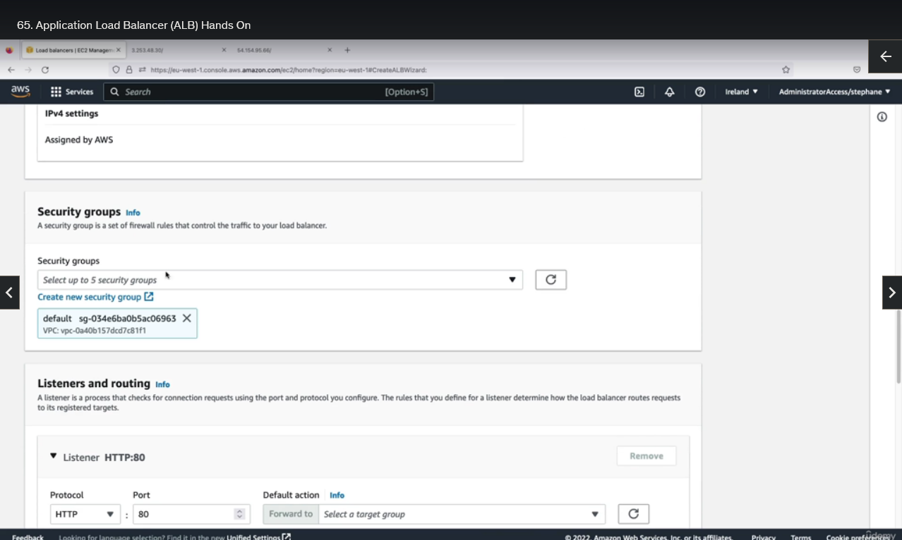

## Application Load Balancer (Hands On)

So we are going to practice launching a Load Balancer, but first, we need to send traffic to something.

So first we're going to launch EC2 Instances. So I'm gonna go into launch instances and I will launch two instances. So on the right hand side I can say two instances and the name's going to be My First Instance. We'll rename the second one when it comes to it. We're going to use Amazon Linux 2 on this architecture. We're going to use a t2.micro, and then we are going to proceed without a key pair because we don't need SSH capability. We can use EC2 Instance Connect if we ever need to. Then for network settings we can select an existing security group and we will use the Launch Wizard 1 security group which allowed us to do HTTP traffic and SSH traffic into our EC2 instance. So that's perfect. We're going to use the basic storage and for advanced details, I will scroll down and I will add some EC2 user data, and to do so I'm going to copy what I have here and paste it here. So this will just launch the EC2 instances the same way we've launched them before using this EC2 user data script. So let's launch our two instances and now we're going to view all instances. So I'm going to rename the second one My Second Instance and save. So let's wait for these instances to be ready. So my EC2 instances are now ready.

I'm going to copy the first IPv4 address and paste it, and I will visit the URL and as you can see, I get a hello world from my instance so this is great. And then I'm gonna go to my second instance right here. I will copy again the IPv4 and then paste it, press enter, and I get a hello world again. So as you can see, two instances give us two hello worlds, and the last part is changing. And so what we'd like to do is to have only one URL to access these two EC2 instances and balance the load between them.

So for this of course, we're going to use a load balancer. So let's scroll down and look at load balancers. And here you can create a load balancer. So we have different load balancer types, and in this demo we're going to only look at the application balancer, but you need to understand the difference between the ALB, the Network Load Balancer, and the Gateway Load Balancer. So for the application of balancer, you can see here it is for HTTP and HTTPS kind of traffic. For the Network Load Balancer it's going to be on the TCP and UDP protocol or TLS over TCP. And this is something you going to use when you need ultra high performance. That means millions of requests per second while maintaining ultra low latency. So this is a very high performance load balancer, this one. And then finally the Gateway Load Balancer right here, as you can see, it's used for security, for intrusion detection, for firewalls and so on. So it's to analyze the network traffic. When it goes to the classic load balancer, by the time you watch this video, this may be gone because the classic load balancer is going away and so therefore I'm not going to discuss it and touch it.

Okay, so let's focus on creating the application load balancer. So I'm going to call this one DemoALB. And if you wanted to read about how load balancing works, you can read it here, but hopefully the previous lecture was enough for you. So this scheme is internet facing and the address type is IPv4.

For network mapping, we we need to decide where to deploy the load balancer and how many availability zones. So let's deploy it in all of them.

Great, and then we need to assign a security group to our load balancer. So it turns out that I'm going to create a new security group for it and we need to only allow HTTP traffic. So I'll call it demo-sg-load-balancer. Allow HTTP into load balancer, into ALB, and the inbound rules is going to allow all HTTP from anywhere. Okay, and the outbound rules are fine. Let's create this security group.

So it is now created and I can go back in here, refresh this page, choose my demo-sg-load-balancer and remove the default security group so that I'm only left with one security group.

So let's scroll down. And we are under listeners and routing. And so we need to route the traffic from HTTP on port 80 to a target group.

And a target group is nothing more than a group of my EC2 instances that were created. So for this we need to create a target group. So let's click here to create one. And the basic configuration tells us that we want to group instances together, but you can see you have other options. So we want to group instances together and I'll call this one demo-tg-alb.

The protocol is HTTP on port 80. You have different options, but based on the option you choose, it's going to be a target group for a different kind of load balancer. So we'll keep it as HTTP on port 80, the version of HTTP is 1 so we'll keep it as 1. The health check is good. And then let's click on next.

And then we need to register our targets. So we're going to register both EC2 instances on port 80, and let's include them as spending below.

So now my instances are registered and let's create this target group.

So it's created, and now I need to refresh my page and actually I had created one before so the one I wanna use is demo-tg-alb. So this target group is created and it's linked to the listener on my load balancer on port 80.

So now I'm good to go and I can go ahead and create my load balancer.

So I'm going to click on view load balancer, and I'm back into this page where I can have a look at my load balancer.

And right now it is in the provisioning space so we need to wait until it is provisioned. So my ALB is now active, it's ready. And as you can see, there's a DNS name available for me. So I'm going to copy this, paste it in a new tab and through the application load balancer I'm able to get a hello world.

But the cool thing about it is that if I refresh this page and keep on refreshing it, then as you can see the target is changing. That's because my application load balancer is actually redirecting between both my EC2 instances, which is very cool. And that's the proof that load balancing is actually happening.

How do we know? Well, if we go to our target group, this one, and we look at the targets of my target group, as you can see they're both healthy. That means that the application load balancer through the target group is going to send traffic to both of them, one after the other.

And the target group is very smart because if I take my first instance for example and I stop it, through this, what we're doing is that we're stopping our two instance and so therefore it's going to be unhealthy because it cannot respond anymore to the traffic coming in.

And so if I go in my target group, maybe I'm too fast, let's see, and refresh, so I will wait about 30 seconds. And now as you can see the first instance is unused because it's in stopped states.

And so therefore, if I go back to my application balancer and refresh, the only response I'm getting for this instance is that one instance that is still up and running.

This is the power of using load balancers because they know when the targets are healthy or not healthy. And so this instance is stopped, but of course if I recover it, if I start it again then it's going to boot up and is going to create the service behind the scenes. And so let's wait for the instance to be started and hopefully we'll see it again as being healthy in our target group. The instance is now up and we are in the initial health status as you can see and now we are in a healthy status. So the instance was deemed healthy and so therefore if I go back to my application balancer and refresh, as you can see now, the hello world is coming from both instances.

So that's it, we've practiced load balancer, we created one as well as two targets in the target group. I hope you liked it, and I will see you in the next lecture.
