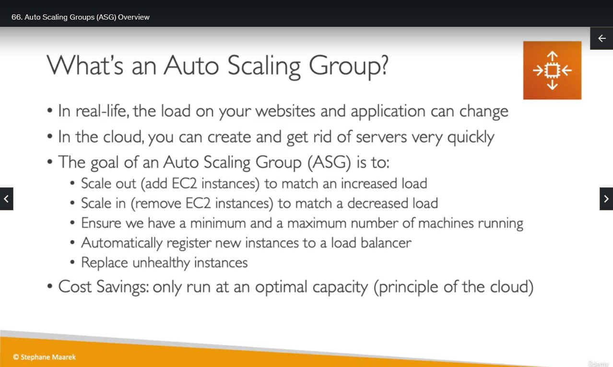
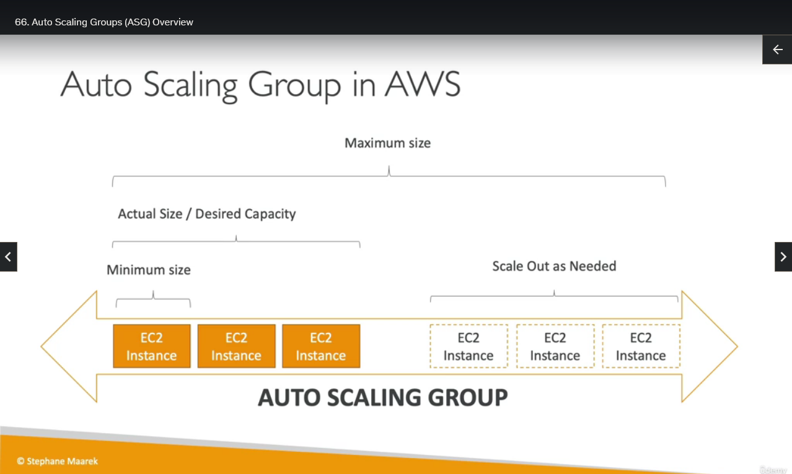
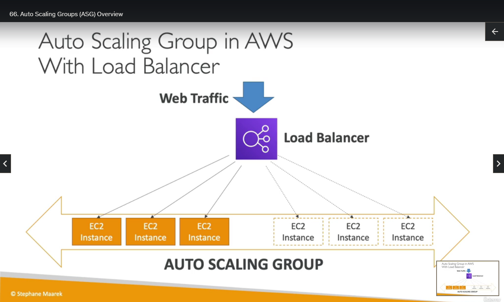

## Auto Scaling Groups Overview

Okay, so now we have an application that can be load balanced through a load balancer, but how do we create, automatically, these servers in the back end. For this, we can use an auto scaling group.

So why? Well, in real life, your load on the websites can change over time. So, for example, say your users are doing shopping, they're most likely doing shopping during the day and not at night. So you expect more load during the day and less load during the night. So in the cloud, we know we can create and get rid of servers very quickly, and so the goal of an auto scaling group is to scale out. That means add EC2 instances to match an increased load or scale in, that means remove EC2 instances to match a decreased load.

With this, we can ensure that we have, also as well, a minimum, and a maximum number of machines running at any point in time, and once the auto scaling group does create or remove EC2 instances, we can make sure that these instances will be registered or deregistered into our load balancer. So these two things work hand in hand.

Finally, in case one of our servers becomes unhealthy, maybe there's an application bug, then the auto scaling group can detect it and say, "Yeah, you know what, I don't need an unhealthy instance. I'm going to deregister it. I'm going to terminate it and replace it with a new healthy one." So with an auto scaling group, we get a lot of benefits, and another benefit we get is that we have huge cost savings because we are only running all the time at the optimal capacity, and that is one of the guiding principles of the cloud, elasticity.

So if we look at our auto scaling group in AWS. This is it. We have a minimum size, maybe it's one EC2 instance. Then there is a setting called desired capacity, which is also usually the actual size of your auto scaling group, and then finally, you can define a maximum size of your auto scaling group, and automatically, your ASG (auto scaling group) can scale out as needed or scale in as needed by adding EC2 instances over time.

And it works hand in hand with a load balancer. So that means that if we have our auto scaling group, for example, with one EC2 instance, web traffic can be coming in through our load balancer, which will be redirecting the traffic directly into your EC2 instance, and as our auto scaling group scales out by adding EC2 instances, the load balancer will have them registered and will send traffic to them as well. So as we add on more EC2 instances, the load balancer distributes more and more of the traffic, all the way to the maximum size of your auto scaling group if it scales to that point.

So that's it for this lecture. In the next lecture, we will be reproducing that very same setup with an auto scaling group, multiple EC2 instances, and a load balancer. So I hope that was helpful, and I will see you in the next lecture.
