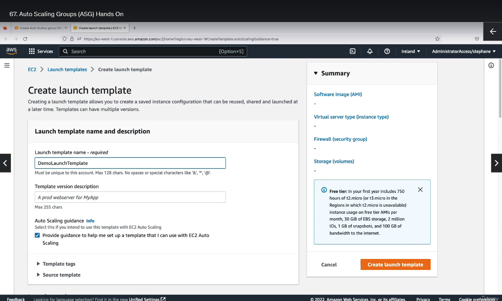
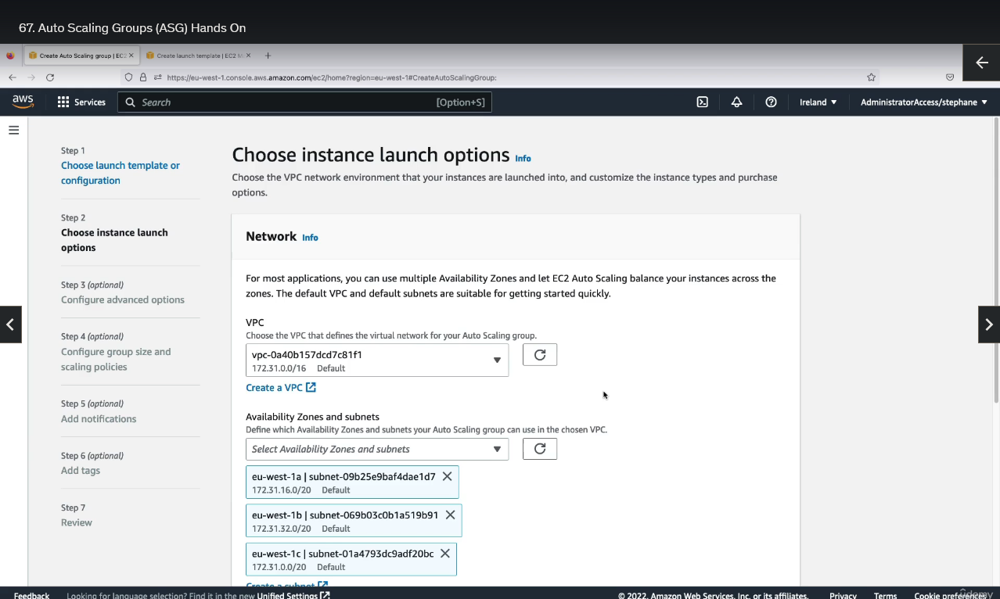
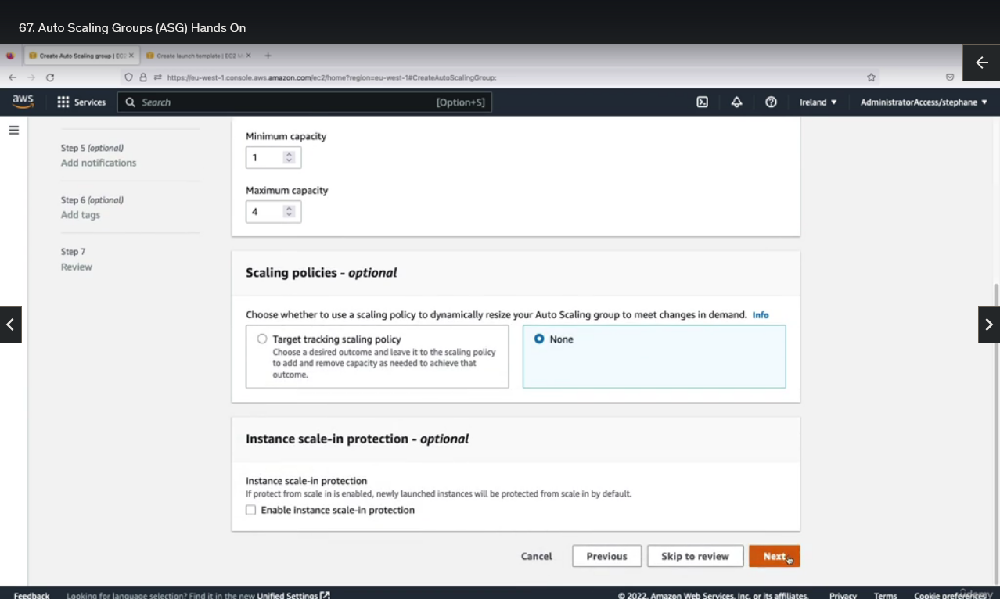

## Auto Scaling Groups (Hands On)

So before we go ahead and practice creating an auto scaling group, you need to take your first two instances, and we're actually going to terminate them. Okay, so now this is done, we can go ahead and create an auto scaling group.

For this, on the bottom left, click on Auto Scaling Group, and we will create an auto scaling group. So I'll call this one DemoASG, and we need to create a launch template. So currently we have none. So let's create a launch template, and I will call this one DemoLaunchTemplate. And this template is being used to tell to the ASG how to create EC2 instances within it. So this will look very, very similar to what we have when we create EC2 instances. As you can see here, I can choose, for example, a quick start Amazon Linux for getting Amazon Linux 2 as the base of my EC2 instance. Then we have an instance type that we can include, for example, t2.micro. For key pair, we will not include it in the launch templates or we can just say that, no, we don't need one, so this is good enough. For subnets, so we'll not include this in the launch templates. For security group, we can select a security group that's already existing. For example, my launch-wizard-1, under advanced network configuration we don't need to do anything. For EBS volumes for storage we don't need to do anything. And then for advanced details we want these instances to start with some user data. And so we scroll all the way down and here we copy and paste the user data. Okay, so let's create this launch template. As you can see, thanks to this launch template we launch EC2 instances just like before.

So let's refresh this and then click on the DemoLaunchTemplate of version 1. So here it describes what is going to happen, the type of instance we're going to have, the security groups and so on. Let's click on next.

Next we need to choose where to launch these instances. So we have our VPC, and then we can select multiple availability zones and subnets. So we select three of them. And for instance type requirements, we can use the one from the launch template or if you wanted to override them but we don't need to actually. So let's click on next.

Next we have load balancers. So we want to attach to an existing load balancer and it's going to be an application balancer. And to do this, we're going to tell the ASG, the auto scanning group, that every instance created should be registered within my demo target group for my ALB. So therefore all these instances will be under the target group, and then the load balancer will be able to direct traffic to them. So the health check can be EC2 and also ELB. So we're good. And then we can click on next.

Now here comes the scaling of the auto scaling group. The desired capacity is how many instances you want at any time. For example, we want two EC2 instances to have some sort of load balancing. The minimum capacity is one, meaning we want at least one instance, and the maximum for them is we want at most four instances. But the desired is what matters the most because this is the actual capacity that we're going to get.

Okay, so then do we want scaling policies? This is too advanced, but you of course can set scaling policies on an auto scaling group. That's the whole point of it, which allows you to resize your ASG on demand. If there is much more demand than is going to have more instances, if there is less requests, less demand than is going to be less instances. So click on next.

Next, we don't need notifications, we don't need tags. We can review everything. It looks good. And let's create our auto scaling group.

So now our auto scaling group is being created and as you can see, the state is updating capacity because we have zero instances in our ASG, but we want to, so I can click on it to get a bit more details. So let's go under activity. And in here we have two activity history. That is we are launching two new EC2 instances because well, the desired capacity went from zero to two.

And so if we have a look under the instance management tab, as you can see now, 2 EC2 instances are independent states.

So if I go under EC2 and look at my EC2 instances, in that UI, we also see that two instances are running and these have been created by my auto scaling group.

So the benefit is that now they are fully managed by my auto scaling group, and let's go see for example, in my target group as well. So if I go to my target group on the left-hand side and look at my demo-tg-alb right here, scroll down. As you can see now we have two total targets and these are the targets created by our auto scanning group.

So again, thanks to the integration that we've defined between the auto scanning group and the load balancer, we are able to have automatically these new EC2 instances registered as targets in our target group. Currently they're unhealthy, this is because the instance hasn't started all the way yet so let's wait a little bit until they become healthy. To speed up the check from unhealthy to healthy, you can go under health checks of your target group, and here you can edit these settings. And under other settings, we can say that the healthy threshold is going to be 2 and the interval is going to be 5 seconds. This is going to make the thing much quicker. So of course the timeout needs to be 2 seconds, something less than the interval itself. So let's save our changes. And now the health check change settings have changed.

Let's see, if I go back into my targets and refresh, now both my instances are healthy. We just made the health check happen faster and more often.

So now both my instances are healthy, and so therefore if I go under my load balancer right here and I look at the DNS name and open it in a new tab, I get a hello world from both my instances. And this is cool because these two instances were created by the auto scaling group.

So because now we have an auto scaling group we can actually do some cool stuff. So if we take one of these instances, for example and we can for example terminate it, so I'm going to click on it and I'm under the instance itself I will do instance state and then terminate instance. Now it's been successfully terminated.

So what's going to happen is that because this instance is being shutting down and terminated, well, my auto scaling group is going to detect that, guess what, one of these instances is not in service anymore, it's being terminated. And so therefore, because we have an auto scaling group with a desired capacity of two instances, automatically a new instance should appear.

So let's observe this behavior by having here the activity history. And as you can see, in progress was terminating EC2 instance. And so an instance was taken out of service because, well, it's been terminated. And then we have a new activity saying, hey, an instance was launched in response to an unhealthy instance needing to be replaced.

So it's very cool because the auto scaling group can automatically detect unhealthy instances and create new one for replacements. So if we go here now, there's one instance in pending state which is being started, one instance being terminated and one instance in service. And this is the whole power of auto scaling groups.

Of course you can go to the next level but for now we know enough which is around automatic scaling to actually define scaling policies to automatically increase or decrease the desired capacity over time, based on our load and so on. But here you've seen the basics and the major features of auto scaling groups, and you could play around by editing the desired capacity yourself to set it to one, for example, to terminate instances and only keep one of them, or to set it to four and see the auto scaling group creates multiple instances that will be registered with our load balancer. So I hope you liked it and I will see you in the next lecture.
