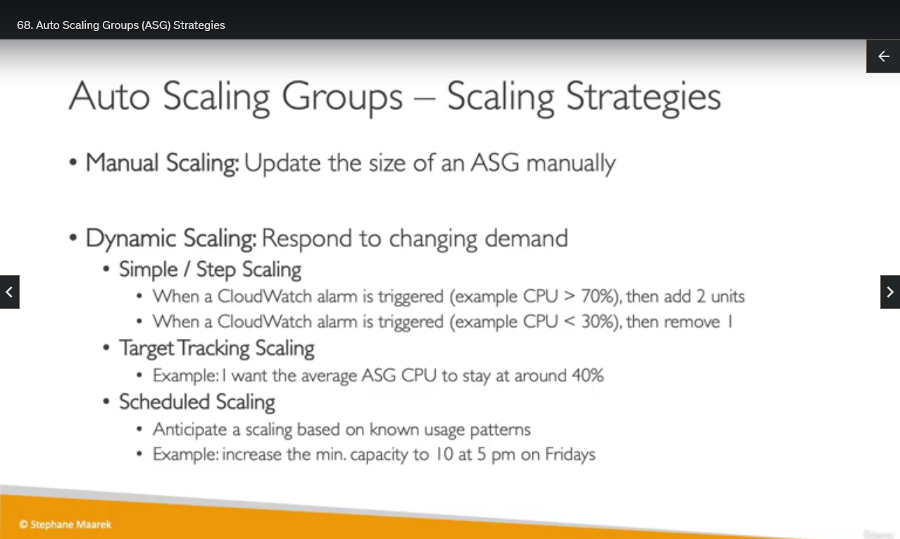
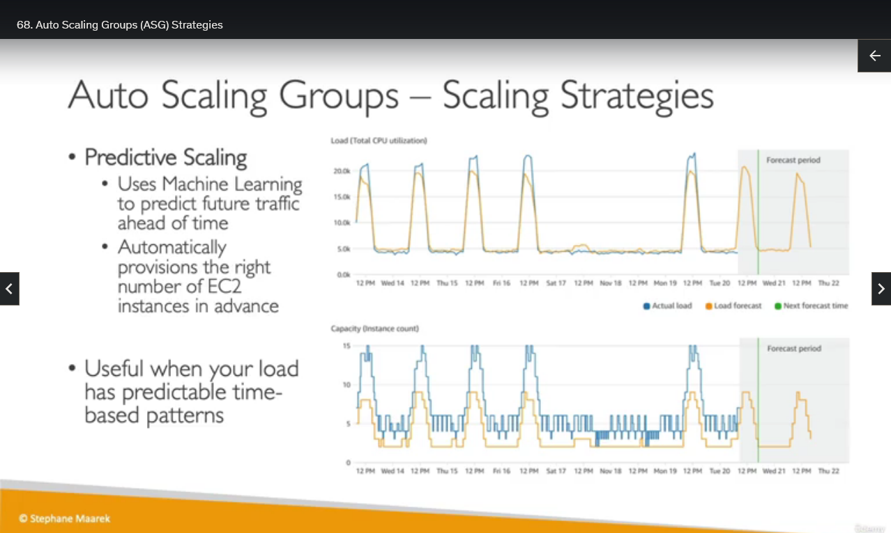

## Auto Scaling Groups Scaling Strategies

Okay, so we've seen how Auto Scaling Groups works, but let's have a look at the different Scaling Strategy for your Auto Scaling Groups.

So the first one is to do Manual Scaling. Which is when we update the size of an Auto Scaling Group manually. And this is when, for example, we change the capacity from one to two, or back from two to one.

Then we can define some Scaling Strategies such as Dynamic Scaling to respond to changing demands automatically. So we have different types of scaling policies within Dynamic Scaling, we have the Simple and the Step Scaling, which is the idea is that whenever a CloudWatch alarm is triggered, for example, you say whenever the average CPU utilization of all my EC2 instances goes over 70% for five minutes, then add two units to capacity to my ASG. Or when another alarm, for example, says whenever the CPU utilization is less than 30% for 10 minutes. Then remove one unit of capacity in my ASG. This would be Simple or Step Scaling because we define the trigger, and then we define how many units we add or remove.

Then we have Target Tracking Scaling, which is a very easy way of defining a scaling policy. The example is to say, hey, I want the average CPU utilization of all the EC2 instances in my ASG to stay at around 40% on average, and then the ASG will scale automatically to make sure that you stay around that target of 40%.

And we have also Scheduled Scaling. So this is when we know that changes are going to happen ahead of time. So we anticipate scaling based on known users' patterns. And, for example, we're saying, hey, we know that on Friday at 5:00 PM, people are going to do sports betting, maybe who knows, before the soccer game, and so please increase the minimum capacity to 10 EC2 instances in my ASG at 5 pm on Friday. This could be a Scheduled Scaling.

And there's one last type of scaling that is definitely appearing on the exam, which is called Predictive Scaling. So this one uses Machine Learning to predict future traffic ahead of time, so there are some algorithms, they will look at the past traffic patterns, and it will forecast what will happen to traffic based on the past patterns. And so the idea is that it's called predictive because we predict what the load will be over time, and maybe the load is just on a daily basis it peaks for three hours. So this is the kind of things that Predictive Scaling will pick up, okay. And it will automatically provision the right number of EC2 instances in advance to match that predicted period. So this is what the graphs you see on the right-hand side. This is very helpful when you have time-based patterns and you just want to have an easy, without any intervention type of scaling trust strategies that are powered by Machine Learning, then that would be Predictive Scaling.

So that's it for this lecture. I hope you liked it. And remember the strategies. I will see you in the next lecture.
