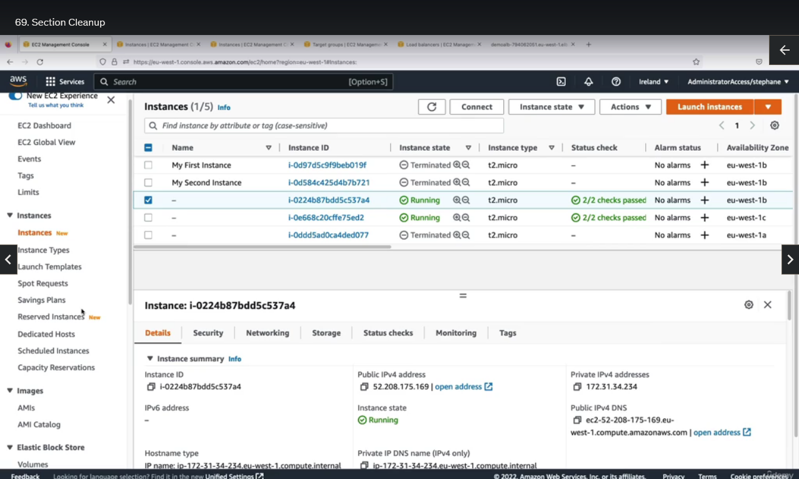
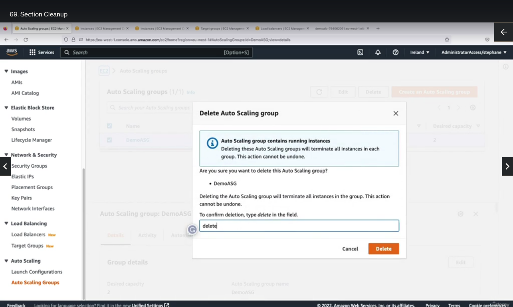
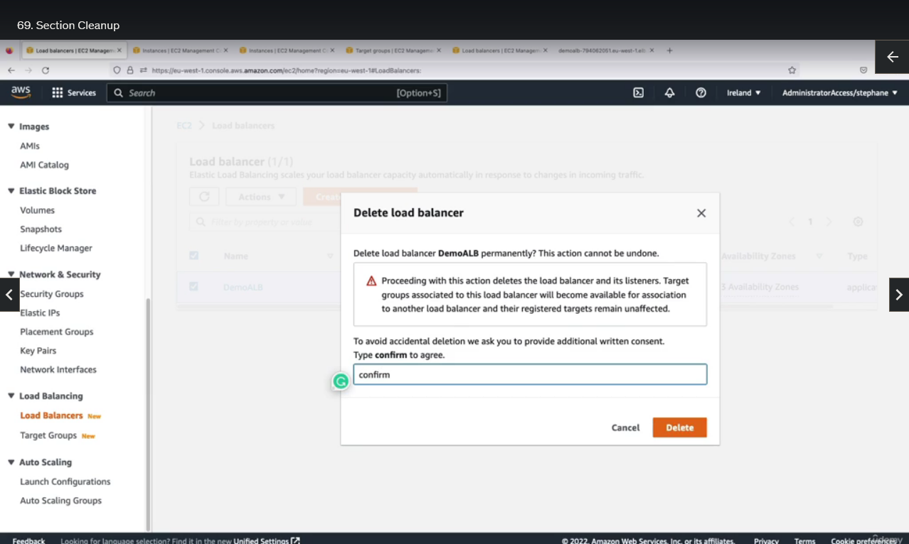

## Section Cleanup

So, we are going to clean up our instances and so on, but if you try to go in instances and actually terminate these two instances, this will not work, because if you do so, then the Auto Scaling Group will recreate them.

So, the strategy here is to actually go under the Auto Scaling Group, and we're going to delete the Auto Scaling Group altogether, so just type 'Delete' in here to confirm the deletion of it.

And then the next thing we have to delete is the low balancer, so find your application balancer action and then delete. Confirm to agree and you're good to go and finally, you may be wondering, well, should I delete my target group? Well, we don't have to because the target group don't cost you any money and the target group is going to be empty because we have deleted the Auto Scaling Group and we have deleted the low balancer.

That's it. When the ASG is going to be gone, then your EC2 instances, that's your ASG managers, will also be gone, so, you'll be fully clean.

So, that's it. We will remain within the free tier for this course. I hope you liked it and I will see you in the next lecture.
