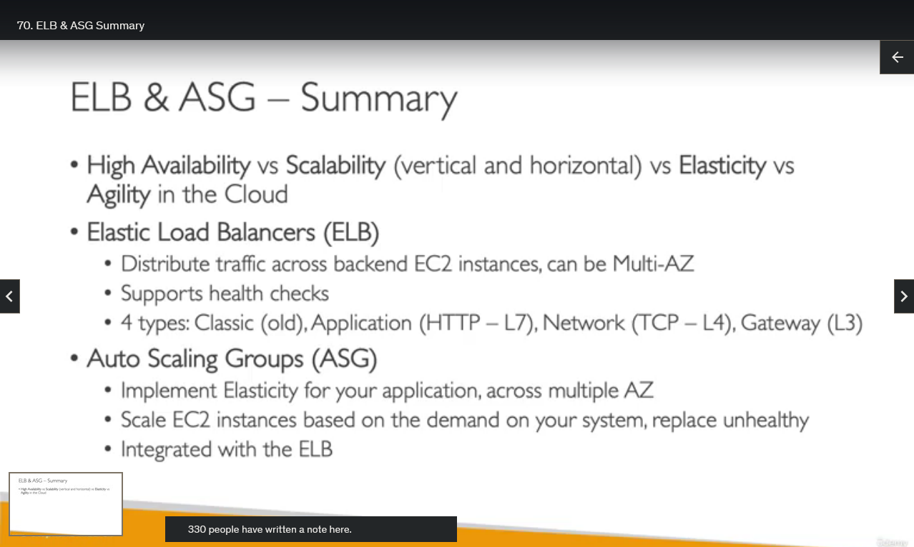

## ELB & ASG Summary

Okay, so let's summarize the section on the ELB and the ASG.

So first, we discussed the concept of high availability. Scalability would be vertical and horizontal, elasticity and agility in the Cloud.

It is very important for you to understand to which concept corresponds to which features.

For example, high availability means that you are having your applications across multiple availability zone.
Vertical scaling means that you're increasing the size of an instance.
And horizontal scaling, is that you are increasing the number of instances. Elasticity is the ability to scale up and down based on demand.
And agility is a concept of the Cloud that is going to be able to make you work faster, because you can create and delete resources very, very quickly.

Now, our load balancers, or ELB, are allowing us to distribute traffic across backend EC2 instances, and they can be spread out across multiple availability zones.
We support health checks to make sure that the backend EC2 instances are indeed healthy.

And we have four kinds of Load Balancers.
The classic one is old and retired.
We have the Application Load Balancer for HTTP type of workload at the layer seven.
Network Load Balancer for very high performance and TCP level load balancing, layer four.
And finally, the Gateway Load Balancer, layer three, to route the network itself, and make it go by, for example, through some virtual appliances.

We have auto scaling groups that allow us to implement elasticity for our application, therefore spreading our load across multiple AZ and scaling accordingly.
So we scale these EC2 instances based on the demand on your system, and we can replace unhealthy instances.
There's a tight integration between the ASG and the ELB.
So this is why they are a great combination, and together, we achieve high availability, scalability, elasticity, and agility in the Cloud.

All right, that's it. I hope you liked it and I will see you in the next lecture.
